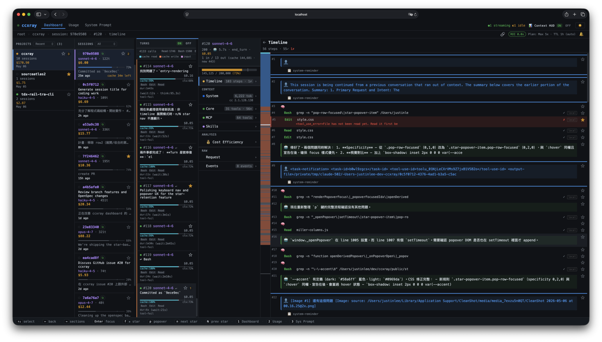
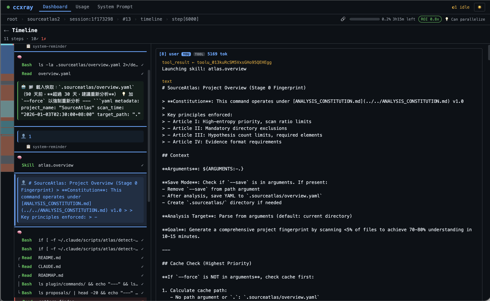
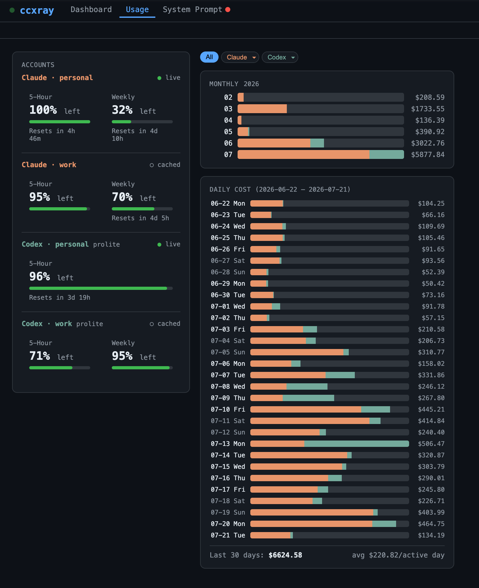
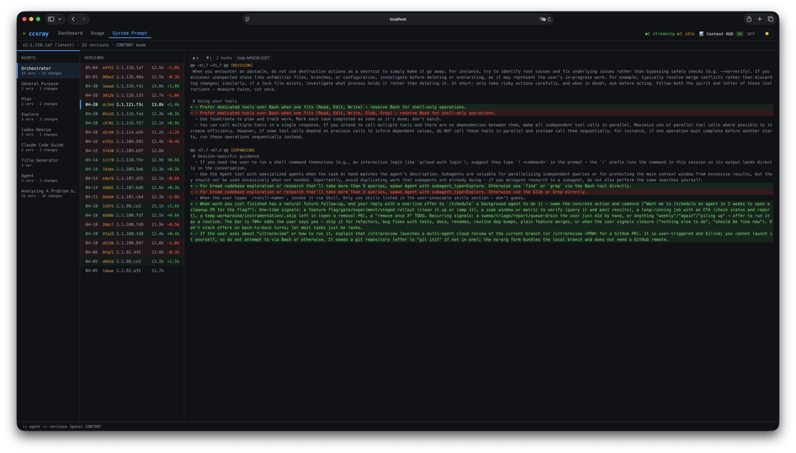
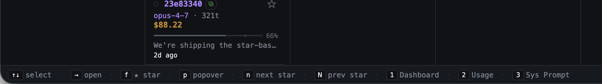
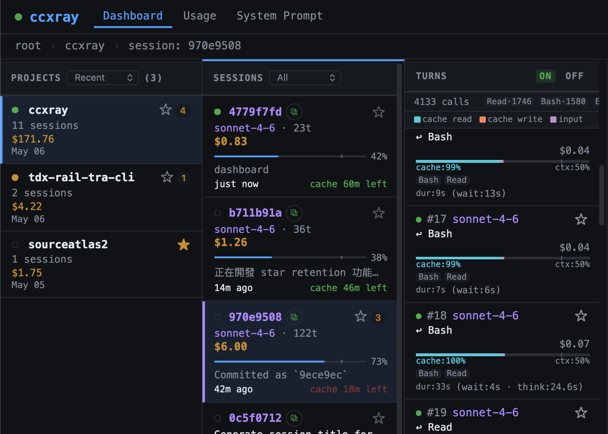

# ccxray

**English** | [正體中文](README.zh-TW.md) | [日本語](README.ja.md)

X-ray vision for AI agent sessions. A zero-config HTTP proxy that records every API call between Claude Code and Anthropic, with a real-time dashboard to inspect what's actually happening inside your agent.


[](https://github.com/hesreallyhim/awesome-claude-code)



## Why

Claude Code is a black box. You can't see:
- What system prompts it sends (and how they change between versions)
- How much each tool call costs
- Why it's thinking for 30 seconds
- What context is eating your 200K token window

ccxray makes it a glass box.

## Quick Start

```bash
npx ccxray claude
```

That's it. Proxy starts, Claude Code launches through it, and the dashboard opens automatically in your browser. Run it in multiple terminals — they automatically share one dashboard.

### Other ways to run

```bash
ccxray                           # Proxy + dashboard only
ccxray claude --continue         # All claude args pass through
ccxray --port 8080 claude        # Custom port (independent, no hub sharing)
ccxray claude --no-browser       # Skip auto-open browser
ccxray status                    # Show hub info and connected clients
ANTHROPIC_BASE_URL=http://localhost:5577 claude   # Point existing claude session at a running ccxray hub
```

### Multi-project

Running `ccxray claude` in multiple terminals automatically shares a single proxy and dashboard — no configuration needed.

```bash
# Terminal 1
cd ~/project-a && ccxray claude     # Starts hub + claude

# Terminal 2
cd ~/project-b && ccxray claude     # Connects to existing hub

# Both projects visible in one dashboard at http://localhost:5577
```

If the hub process crashes, connected clients automatically recover within seconds.

```bash
$ ccxray status
Hub: http://localhost:5577 (pid 12345, uptime 3600s)
Connected clients (2):
  [1] pid 23456 — ~/dev/project-a
  [2] pid 34567 — ~/dev/project-b
```

Use `--port` to opt out and run an independent server instead.

## Features

### Timeline

Watch your agent think in real-time. Every turn renders as a five-line card: cost on line 1, cache warmth (with inter-turn gap timing to catch cache misses), tool-fail risk, `hit:0%` red warnings, and tools surfaced above the title. Scan a whole session's health without expanding a single card.



### Usage & Cost

Track your real spending. Session heatmap, burn rate, ROI calculator — know exactly where your tokens go.



### System Prompt Tracking

Automatic version detection with diff viewer. Browse prompts across 11 recognized agent types — Orchestrator, General Purpose, Plan, Explore, Web Search, Codex Rescue, Claude Code Guide, Summarizer, Title Generator, Name Generator, Translator — and see exactly what changed between updates. Precision-verified against 12,730 captured prompts: 100% of classifications are correct, uncertain prompts are honestly marked `unknown`.



### Keyboard-first Navigation

Drive the whole dashboard with your keyboard. Every screen shows a context-sensitive hint bar at the bottom — the currently valid shortcuts, live-updated as you move. Press `?` for the full cheatsheet. Navigate projects → sessions → turns → sections → timeline → individual diff hunks without touching the mouse.



### Session Titles & Cache Alerts

Session cards show Claude Code's generated titles (e.g. `Fix login button on mobile`) instead of raw hashes, with a live cache TTL countdown (`cache 4m left`) that pulses red under 1 minute. When any session nears expiry, the browser tab alternates between `ccxray` and `⚠ ccxray`. Opt-in browser notification fires at a plan-aware lead time — 5 minutes for Max, 60 seconds for Pro/API key. Titles fall back to the short hash for direct-API traffic or sessions still in flight.



### Plan Detection

ccxray auto-detects your subscription plan (Pro vs Max 5x vs Max 20x) by reading Anthropic's `cache_creation` usage fields — no configuration needed. Topbar shows `Plan: Max 5x · TTL 1h (auto)`. ROI calculations and quota panel use the detected plan. Override with `CCXRAY_PLAN` if auto-detection gets it wrong.

### Intercept & Edit Requests

Pause requests before they reach Anthropic. Toggle intercept on a session and the next request from Claude Code is held in the dashboard — edit the system prompt, messages, tools, or sampling parameters, then approve (forwards your edited copy) or reject (returns an error to Claude Code). Useful for prompt engineering, sandboxing risky tool calls, and running experiments without forking the agent.

### Context HUD

Optional context-stats footer appended to Claude's responses inside Claude Code itself: `📊 Context: 28% (290k/1M) | 1k in + 800 out | Cache 99% hit | $0.15`. Enabled by default; toggle from the dashboard topbar.

**Why a toggle?** When the parent agent calls sub-agents (Agent / Task tool), the appended block can truncate the sub-agent's response before it's returned to the parent — causing silent data loss in multi-agent workflows. Turn the HUD off when running sub-agent-heavy sessions. State persists in `~/.ccxray/settings.json`.

### More

- **Session Detection** — Automatically groups turns by Claude Code session, with project/cwd extraction
- **Token Accounting** — Per-turn breakdown: input/output/cache-read/cache-create tokens, cost in USD, context window usage bar

## How It Works

```
Claude Code  ──►  ccxray (:5577)  ──►  api.anthropic.com (or ANTHROPIC_BASE_URL)
                      │
                      ▼
              ~/.ccxray/logs/ (JSON)
                      │
                      ▼
                  Dashboard (same port)
```

ccxray is a transparent HTTP proxy. It forwards requests to Anthropic, records both request and response as JSON files, and serves a web dashboard on the same port. No API key needed — it passes through whatever Claude Code sends.

## Configuration

### CLI flags

| Flag | Description |
|---|---|
| `--port <number>` | Port for proxy + dashboard (default: 5577). Opts out of hub sharing. |
| `--no-browser` | Don't auto-open the dashboard in your browser |

### Environment variables

| Variable | Default | Description |
|---|---|---|
| `PROXY_PORT` | `5577` | Port for proxy + dashboard (overridden by `--port`) |
| `BROWSER` | — | Set to `none` to disable auto-open |
| `AUTH_TOKEN` | _(none)_ | API key for access control (disabled when unset) |
| `CCXRAY_HOME` | `~/.ccxray` | Base directory for hub lockfile, logs, and hub.log |
| `CCXRAY_MAX_ENTRIES` | `5000` | Max in-memory entries (oldest evicted; disk logs unaffected) |
| `LOG_RETENTION_DAYS` | `14` | Auto-prune log files older than N days on startup. Files referenced by restored entries are protected. Set to `0` to disable. |
| `RESTORE_DAYS` | `0` | Limit which days of logs to load on startup (`0` = all, subject to `CCXRAY_MAX_ENTRIES`). Useful for very large log directories. |
| `CCXRAY_PLAN` | _(auto)_ | Override plan detection: `pro`, `max5x`, `max20x`, `api-key` |
| `CCXRAY_DISABLE_TITLES` | _(unset)_ | Set to `1` to disable session title extraction (sessions fall back to short hash) |
| `CCXRAY_MODEL_PREFIX` | _(unset)_ | Prepend a string to the model name before forwarding (e.g. `databricks-`). Useful when the upstream requires a vendor-prefixed model name but Claude Code only accepts standard names. |
| `HTTPS_PROXY` / `https_proxy` | _(unset)_ | Route outbound HTTPS traffic through a corporate proxy via HTTP CONNECT tunnel. |
| `ANTHROPIC_BASE_URL` | — | Custom upstream Anthropic endpoint (e.g. a corporate gateway). Supports base paths — `https://host/serving-endpoints/anthropic` works as-is. `ANTHROPIC_TEST_*` take precedence when set. |

Logs are stored in `~/.ccxray/logs/` as `{timestamp}_req.json` and `{timestamp}_res.json`. Upgrading from v1.0? Logs previously in `./logs/` are automatically migrated on first run.

### S3 / R2 storage backend

Set `STORAGE_BACKEND=s3` to write logs to S3-compatible storage (AWS S3, Cloudflare R2, MinIO) instead of local disk. Requires `@aws-sdk/client-s3` to be installed.

| Variable | Default | Description |
|---|---|---|
| `STORAGE_BACKEND` | `local` | `local` or `s3` |
| `S3_BUCKET` | _(required)_ | Bucket name |
| `S3_REGION` | `auto` | Region (use `auto` for R2) |
| `S3_ENDPOINT` | _(unset)_ | Custom endpoint URL (R2 / MinIO) |
| `S3_PREFIX` | `logs/` | Key prefix inside the bucket |

## Docker

```bash
docker build -t ccxray .
docker run -p 5577:5577 ccxray
```

## Requirements

- Node.js 18+

## Also by the author

- [SourceAtlas](https://sourceatlas.io/) — Your map to any codebase
- [AskRoundtable](https://github.com/AskRoundtable/expert-skills) — Make your AI think like Munger, Feynman, or Paul Graham
- Follow [@lis186](https://x.com/lis186) on X for updates

## License

MIT
