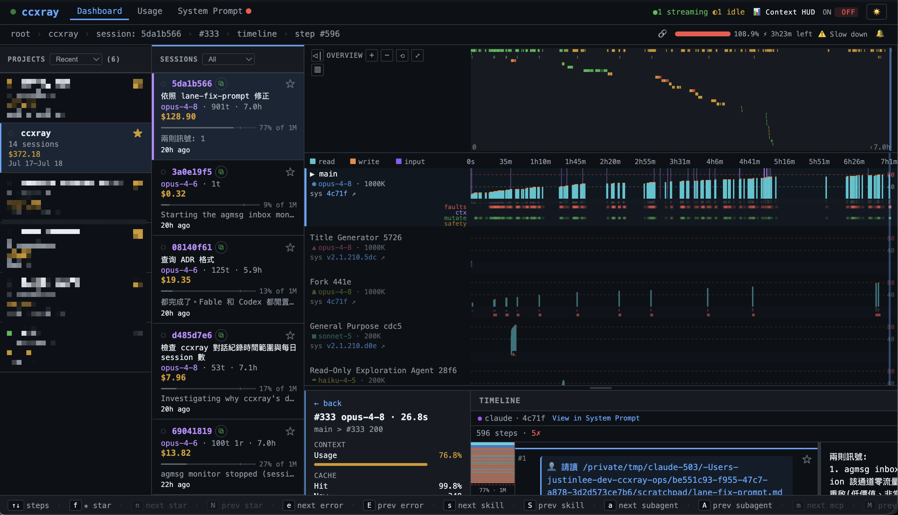
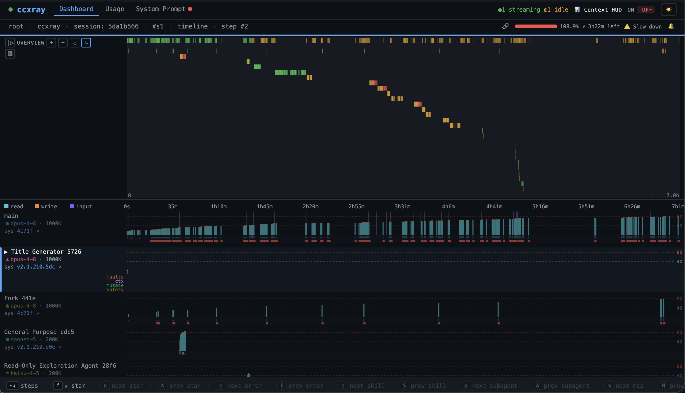
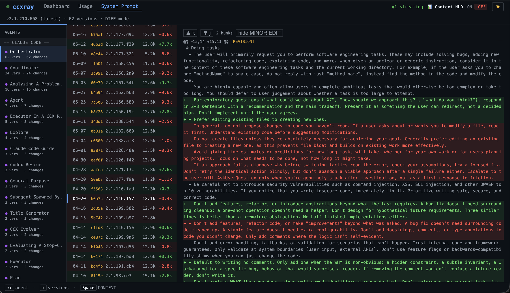
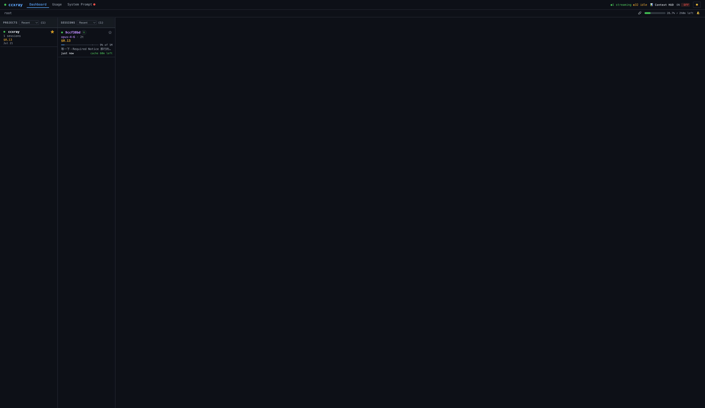
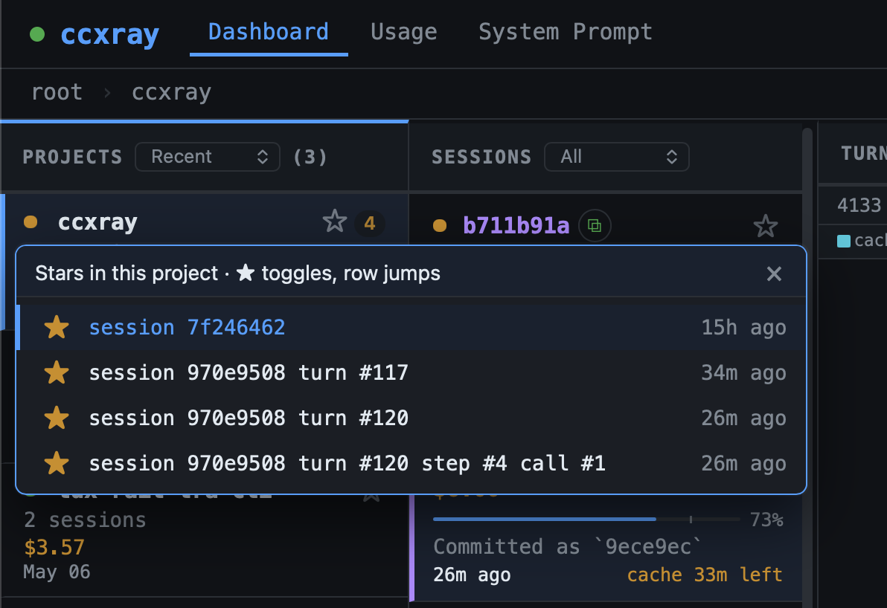

# ccxray

[English](README.md) | **正體中文** | [日本語](README.ja.md)

AI 代理工作階段的透視鏡。零設定的 HTTP 代理，記錄 Claude Code、Codex 與上游 API 之間的每一次呼叫，搭配即時儀表板與工作流程時間軸，讓你看清代理內部到底在做什麼。


[](https://github.com/hesreallyhim/awesome-claude-code)



## 為什麼需要

Claude Code 是個黑盒子。你看不到：
- 它送出了什麼 system prompt（以及版本間的變化）
- 每次 tool call 花了多少錢
- 為什麼它思考了 30 秒
- 什麼東西吃掉了你的 200K token 上下文窗口

ccxray 讓它變成透明的。

## 快速開始

```bash
npx ccxray claude
# 或
npx ccxray codex
```

就這樣。代理啟動、選定的 CLI 透過代理連線、儀表板自動在瀏覽器中開啟。在多個終端機執行時會自動共用同一個 dashboard。

launcher 參數由 provider registry 管理。目前支援 `claude` 與 `codex`；未知的 provider command 會直接失敗，避免靜默啟動未設定的 proxy。

### 其他執行方式

```bash
ccxray                           # 只啟動代理 + 儀表板
ccxray claude --continue         # 所有 claude 參數直接穿透
ccxray codex exec "hello"        # 所有 codex 參數直接穿透
ccxray --port 8080 claude        # 自訂 port（獨立模式，不共用 hub）
ccxray claude --no-browser       # 不自動開啟瀏覽器
ccxray status                    # 顯示 hub 資訊及已連線的 client
ANTHROPIC_BASE_URL=http://localhost:5577 claude   # 將現有 claude session 指向運行中的 ccxray hub
```

### 多專案

在多個終端機執行 `ccxray claude` 會自動共用同一個 proxy 和 dashboard — 無需任何設定。

```bash
# Terminal 1
cd ~/project-a && ccxray claude     # 啟動 hub + claude

# Terminal 2
cd ~/project-b && ccxray claude     # 連線至現有 hub

# 兩個專案都顯示在 http://localhost:5577 的 dashboard
```

如果 hub 意外終止，已連線的 client 會在數秒內自動恢復。

```bash
$ ccxray status
Hub: http://localhost:5577 (pid 12345, uptime 3600s)
Connected clients (2):
  [1] pid 23456 — ~/dev/project-a
  [2] pid 34567 — ~/dev/project-b
```

使用 `--port` 可改為獨立模式。

## 功能

### 工作流程時間軸

即時觀看代理的思考過程與並行結構。

**Turn 卡片**：每個回合渲染成五層資訊卡——cost、cache 熱度（含 turn 間空檔時間，及時抓出 cache miss）、tool 失敗風險訊號、`hit:0%` 紅色警示、tools 列前置於標題上方。整場 session 的健康狀態一眼掃完。

**Lane 視覺化**：多 agent session 自動拆分為平行 lane——主流程走主 lane，subagent 分出 Fork / Teammate lane。每條 lane 有 WCAG ≥3:1 對比的獨立色彩，支援混合 model 標示。Sequential-interleave tracker 標記同一對話中哪些 turn 是循序、哪些是並行。

**鳥瞰模式**：切換 birdseye overview 可將 overview 區域放大到 80% viewport，搭配放大版 minimap 與範圍摘要，掌握長 session 的全貌。

**L1/L2 雙層選取**：Tab / ▲▼ 選取 lane（L1），j/k 在 lane 內選取 turn（L2），Esc 逐層退出。取代舊的單層 click 模型。



### 用量與成本

追蹤你的實際花費。消耗速率、各帳號 Claude 及 Codex 速率限制卡片 — 精確掌握 token 流向。


### System Prompt 追蹤

自動偵測版本變更，內建 diff 檢視器。瀏覽多種已辨識的 agent 類型，精確掌握每次更新的差異。不確定的項目會誠實標為 `unknown`。



### 鍵盤導航

整個儀表板都能用鍵盤操控。每個畫面底部都有情境感知的快捷鍵提示列，會隨你移動即時更新目前有效的按鍵。按 `?` 展開完整快捷鍵清單。從 projects → sessions → timeline → 個別 diff hunk，全程不用碰滑鼠。

**工作流程導航**：Tab / ▲▼ 在 lane 之間切換（L1 選取），j/k 在 lane 內的 turn 之間切換（L2 選取），Esc 逐層退出回上一層。

**步驟類型跳轉**：`e`/`E` 跳到下/上一個錯誤，`s`/`S` 跳到 Skill 呼叫，`a`/`A` 跳到 subagent（Agent/Task）呼叫，`m`/`M` 跳到 MCP 工具呼叫。每次跳轉都有位置感知——從目前位置往前或往後找最近的符合步驟，並同步更新網址列。

`n`/`N` 可在整個儀表板中跳到下/上一個加星項目——跨越 projects、sessions、turns 及 timeline 的個別步驟。快捷鍵列只在目前畫面有可到達的加星項目時才顯示此按鍵。



### Session 標題與 Cache 提醒

Session 卡片顯示 Claude Code 自動生成的標題（例如 `Fix login button on mobile`），並附有即時 cache TTL 倒數（`cache 4m left`），不到 1 分鐘時變紅閃爍。任何 session 接近到期時，瀏覽器分頁標題會在 `ccxray` 和 `⚠ ccxray` 之間交替。可選的瀏覽器通知會在計畫感知的提前時間觸發 — Max 提前 5 分鐘、Pro/API key 提前 60 秒。直接 API 呼叫或標題生成仍在進行中的 session 退回顯示短雜湊。


### 計畫自動偵測

ccxray 透過讀取 Anthropic 的 `cache_creation` 用量欄位，自動偵測你的訂閱計畫（Pro、Max 5x、Max 20x），無需任何設定。Cache TTL 和配額門檻均使用偵測到的計畫。若偵測結果有誤，可用 `CCXRAY_PLAN` 覆蓋。

### 各帳號速率限制

在同一個儀表板上查看每個 Claude 和 Codex 帳號的 5 小時和每週配額用量。自動偵測 `~/.codex-*/sessions/` 以支援多帳號 Codex 設定，並透過 `ccxray setup-statusline` 讀取 Claude statusline 資料。Business/unlimited Codex 計畫顯示 `∞ Unlimited`。資料每 30 秒在背景非同步刷新，不阻塞 proxy。

### 請求攔截與編輯

在請求送出至 Anthropic 之前先暫停。在 session 上開啟攔截後，下一個來自 Claude Code 的請求會被儀表板留住 — 你可以即時編輯 system prompt、訊息、tools 或 sampling 參數，再選擇放行（轉發你編輯後的版本）或拒絕（回傳錯誤給 Claude Code）。適合 prompt engineering、把高風險 tool call 隔離在沙箱裡、或在不分叉 agent 的情況下做實驗。

### Context HUD

可選的上下文統計區塊，會被附加到 Claude Code 中 Claude 的回覆尾端：`📊 Context: 28% (290k/1M) | 1k in + 800 out | Cache 99% hit | $0.15`。預設啟用；可從儀表板頂部列切換。

**為什麼需要這個開關？** 當主 agent 透過 Agent / Task tool 呼叫 sub-agent 時，附加的區塊可能會把 sub-agent 的回傳內容截斷在父 agent 看到的範圍之外，造成多 agent 工作流程靜默地遺失資料。跑 sub-agent 較重的 session 時請關掉 HUD。狀態保存在 `~/.ccxray/settings.json`。

### 加星永久保留

在 turn、session 或 project 卡片上點星號，即可標記為永久保留。加星項目不會被 `LOG_RETENTION_DAYS` 的自動清理刪除;狀態存於 `~/.ccxray/settings.json`,server 端持續、跨瀏覽器同步。Star 一個 turn 連帶保護整個 session 的所有 turn;star 一個 session 保護其下所有 turn;star 一個 project 保護其下所有資料。Sentinel bucket(`direct-api`、`(unknown)`、`(quota-check)`)禁止在 bucket 層加星——請對裡面的個別 turn 加星即可。

Timeline 的個別步驟也可以加星（每個步驟 row 上有 `★`/`☆` toggle）。加星的步驟與直接對 turn 加星效果相同，同樣保護其 parent turn 和 session。

當父層因為下方有 starred 子項目而被間接保留,badge 會顯示 `☆ [N]` 而非 `★`。點 chip 數字會展開 popover,列出究竟是哪些子項目在保它。每筆的星號是獨立 toggle;點 row 主體則直接跳到該 turn / session。



### 使用量分析 CLI

```bash
ccxray usage                          # 人類可讀摘要
ccxray usage --json                   # JSON 輸出，供 agent 消費 (< 4KB)
ccxray usage --last 7d                # 最近 7 天（支援 d/h/m）
ccxray usage --cwd myproject          # 目錄名子字串智慧比對
ccxray usage --cwd ~/code/app         # 絕對路徑或 ~ 路徑 → 子目錄樹前綴比對
ccxray usage --cwd proj-a,proj-b      # 多個專案 → 比較表
ccxray usage --session latest         # 最近的 session
ccxray usage --session costliest      # 最貴的 session
ccxray usage --session "fix login"    # 依 session 標題搜尋
ccxray usage --session 950432         # UUID 前綴比對
ccxray usage --session costliest --open  # 在儀表板開啟該 session
ccxray usage --tools                  # 完整工具呼叫明細
```

0.6 秒完成自動化使用量分析 — 不用手動翻 log 就能知道 token 和錢花在哪。直接讀取 `index.ndjson`，不需要啟動 server。顯示模型成本分佈、工具與 skill 使用量、prompt hash 穩定性（system/tools/core prompt 在 turn 間的變化頻率）、依 turn 間隔的 cache 命中率、以及花費最高的 10 個 session（含標題）。

### 其他功能

- **Deep Link 導航** — 每個選取狀態（project / session / turn / step）都會反映在網址列 URL 中。把 URL 貼到新分頁，儀表板會直接導航到相同的畫面。
- **可收合側欄** — overview 面板可收合，給 timeline 更多空間。
- **Cache TTL 分項** — turn 詳情顯示 cache 使用的是 5 分鐘或 1 小時 TTL。
- **隱藏專案** — 在 `settings.json` 設定 `hiddenProjects` 隱藏特定專案，分享時不洩漏。
- **Per-session 還原上限** — `CCXRAY_SESSION_ENTRY_CAP` 限制啟動還原時單一 session 載入的條目數，防止巨量 session 擠掉其他 session。
- **工作階段偵測** — 自動依 Claude Code session 分組，含專案/工作目錄擷取
- **Token 記帳** — 每回合明細：input/output/cache-read/cache-create tokens、美元成本、上下文窗口使用率

## 運作原理

```
Claude Code  ──►  ccxray (:5577)  ──►  api.anthropic.com（或 ANTHROPIC_BASE_URL）
                      │
                      ▼
                  ~/.ccxray/logs/ (JSON)
                      │
                      ▼
                  儀表板（同一連接埠）
```

ccxray 是透明的 HTTP 代理。它將請求轉發到上游 API（Anthropic 或 OpenAI），將請求與回應記錄為 JSON 檔案，並在同一連接埠提供網頁儀表板。所有端點均強制認證：launcher 啟動的 CLI 會自動注入 `X-Ccxray-Auth` header，使用者無感；直接呼叫 `/v1/*` 的 script 需自行帶上此 header（詳見 CHANGELOG）。Hub 間通訊透過 Unix domain socket（`~/.ccxray/hub.sock`）而非 HTTP。

## 設定

### CLI 參數

| 參數 | 說明 |
|---|---|
| `--port <number>` | 代理 + 儀表板的連接埠（預設：5577）。使用後不共用 hub。 |
| `--no-browser` | 不自動在瀏覽器中開啟儀表板 |

### 環境變數

| 變數 | 預設值 | 說明 |
|---|---|---|
| `PROXY_PORT` | `5577` | 代理 + 儀表板的連接埠（`--port` 會覆蓋此值） |
| `BROWSER` | — | 設為 `none` 可停用自動開啟 |
| `AUTH_TOKEN` | _（自動產生）_ | 存取控制用金鑰。未設定時由 `<CCXRAY_HOME>/local-secret` 衍生（預設 `~/.ccxray/local-secret`），所有端點仍強制認證。 |
| `CCXRAY_SESSION_ENTRY_CAP` | `500` | 啟動還原時單一 session 最多載入的條目數。超過此值的 session 只保留最新 1 筆（runtime 不限制） |
| `CCXRAY_LOOPBACK_REQUIRE_AUTH` | _（未設定）_ | Loopback 預設免認證；設為 `1` 可強制 loopback 也走認證閘門 |
| `CCXRAY_HOME` | `~/.ccxray` | 基底目錄，存放 hub lockfile、logs、hub.log |
| `CCXRAY_MAX_ENTRIES` | `5000` | 記憶體中最多保留的條目數（最舊的會被淘汰；磁碟日誌不受影響） |
| `LOG_RETENTION_DAYS` | `14` | 啟動時自動清除超過 N 天的日誌檔案。加星的 turn / session / project（及其下所有條目）會受保護;仍被還原條目參照的檔案也會受保護。設為 `0` 可停用。 |
| `RESTORE_DAYS` | `14` | 限制啟動時讀回的日誌天數（`0` = 全部，仍受 `CCXRAY_MAX_ENTRIES` 上限影響）。日誌目錄非常大時很有用。 |
| `CCXRAY_PLAN` | _（自動）_ | 覆蓋計畫偵測：`pro`、`max5x`、`max20x`、`api-key` |
| `CCXRAY_DISABLE_TITLES` | _（未設定）_ | 設為 `1` 可停用 session 標題擷取（退回顯示短雜湊） |
| `CCXRAY_MODEL_PREFIX` | _（未設定）_ | 轉發前在 model 名稱前加上前綴（例如 `databricks-`）。適用於上游需要廠商前綴 model 名稱、但 Claude Code 只接受標準名稱的情況。 |
| `HTTPS_PROXY` / `https_proxy` | _（未設定）_ | 透過 HTTP CONNECT tunnel 將對外 HTTPS 流量導向企業 proxy。 |
| `ANTHROPIC_BASE_URL` | — | 自訂上游 Anthropic 端點（例如企業閘道）。支援 base path — `https://host/serving-endpoints/anthropic` 直接可用。設定了 `ANTHROPIC_TEST_*` 時以其為準。 |

日誌儲存在 `~/.ccxray/logs/`，格式為 `{timestamp}_req.json` 和 `{timestamp}_res.json`。從 v1.0 升級？`./logs/` 中的日誌會在首次啟動時自動遷移。

ccxray 目前僅將日誌儲存於本機檔案系統。遠端物件儲存後端（S3 / R2）尚未支援——它還需要在儲存介面以及「把 request／response 日誌送出本機」的安全模型上做更多設計。

## Docker

```bash
docker build -t ccxray .
docker run -p 5577:5577 ccxray
```

## 系統需求

- Node.js 18+

## 作者的其他作品

- [SourceAtlas](https://sourceatlas.io/) — 任何 codebase 的導航地圖
- [AskRoundtable](https://github.com/AskRoundtable/expert-skills) — 讓你的 AI 像 Munger、Feynman、Paul Graham 一樣思考
- 在 X 上追蹤 [@lis186](https://x.com/lis186) 獲取最新動態

## 授權

PolyForm Noncommercial 1.0.0 — 見 [LICENSE](LICENSE)
