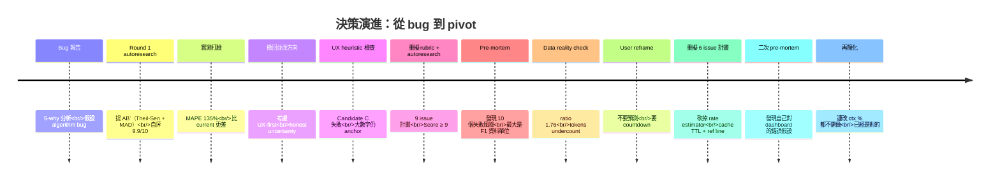
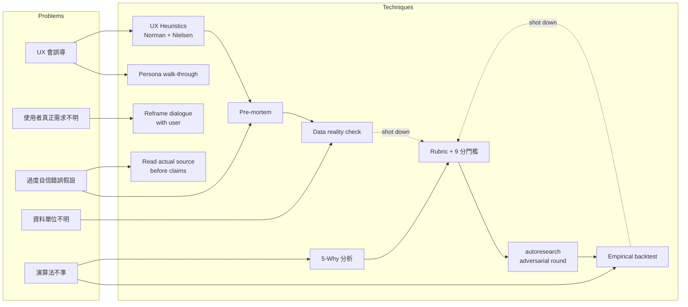
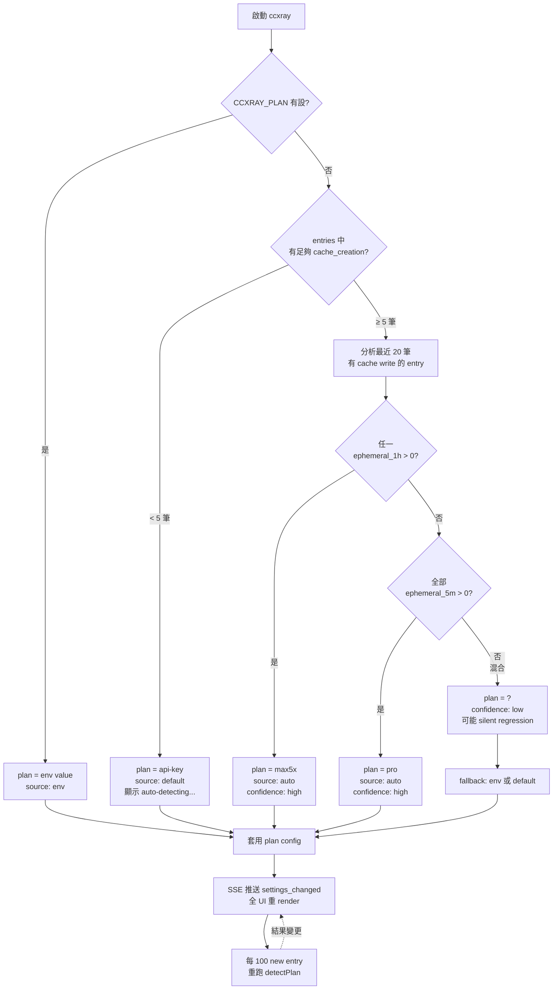
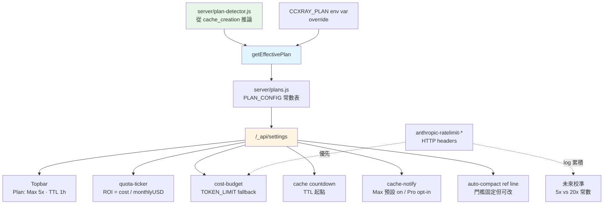

# Process Study: 從「修 predictor」到「移除 predictor」的決策旅程

> 一個不起眼的 10 倍高估 bug，花了一整個下午才決定正確修法是「根本不做預測」。
> 這份文件記錄當時的思考路徑、用到的決策技巧、踩過的陷阱、以及可重複使用的 template。
> 面向：在面對 **UX × 演算法 × 資料** 三維交錯的不確定性問題時，如何逐步收斂到正確決策。

---

## TL;DR

| 里程碑 | 決策 | 觸發事件 |
|---|---|---|
| 1. Bug 報告 | 假設是 predictor 的 algorithm bug | 5 倍、10 倍、甚至 35 倍高估 |
| 2. 提 Theil-Sen 方案 | 自評 9.9/10，準備上線 | rubric-based autoresearch 收斂 |
| 3. 實測 Backtest | 打臉：**135% MAPE，比原本更差** | 跑真實 15 session 資料 |
| 4. UX 評估新方案 | C 方案 Error Prevention 僅 3/10 | Norman + Nielsen 分析 |
| 5. 事前驗屍 | 10 個失敗模式浮現 | Kahneman pre-mortem |
| 6. 資料單位檢查 | usage.sum ≠ tokens.total，差 1.5–2x | 對 226 筆 paired 樣本 |
| 7. User reframe | 「要的是 countdown 不是預測」 | 使用者一句話點破 |
| 8. Pivot | 移除 predictor，加 cache TTL + auto-compact 參考線 | 六議題精簡到可執行 |
| 9. 二次驗屍 | 發現之前讀 code 沒驗證的錯誤假設 | 再 pre-mortem |
| 10. 最終簡化 | 連「改 ctx %」都不需做 | 讀實際 code |

**總花費**：~3 小時（含 5 次重新評估方向）
**避免的浪費**：~15–20 小時的錯誤實作工

---

## 決策時序圖



---

## 技巧矩陣：用什麼打什麼



每個技巧都**可能推翻前一個技巧的結論**。規則：**後來的證據勝過先前的推理**。

---

## 完整時序（含自我推翻）

### Stage 1：Bug 報告到第一個演算法方案

```
Bug 觀察  →  5-Why 分析  →  設計 Rubric  →  autoresearch（Gen-A → Critic → Gen-B → Synth → Judge）
                                                                                       ↓
                                                                              收斂到 AB' 自評 9.9/10
```

**特點**：純推理，零實證。

### Stage 2：實證打臉

```
跑 15 個真實 session 的 backtest
  │
  ├─ 計算 usage.sum delta-based rate
  ├─ 預測 remaining turns
  └─ 對比實際觀察 remaining turns
         ↓
MAPE = 135% ← 比 current 87% 更差
         ↓
撤回 9.9/10 自評，修正為 6.8/10 ← FAIL
```

**關鍵教訓**：**自評分數在實證前毫無意義**。我的「9.9」建立在理論推導上（Theil-Sen 文獻 MAPE <20%），沒考慮「對話有相位變化」這個 real-world 因素。

### Stage 3：UX 角度再檢查

```
提 Candidate C（範圍顯示：≈30-367 turns, low）
     │
     ├─ Norman Mapping 檢查 → 範圍方向反直覺（大數字其實是樂觀值）
     ├─ Nielsen Error Prevention → 367 仍在螢幕上保留 anchor
     └─ 3 persona walkthrough
           ├─ Rushed user → anchor 大數字 → 同原 bug 的錯誤決策
           ├─ First-time user → 看不懂「low」
           └─ Power user → 範圍太寬直接無視
                ↓
UX 綜合 5.0/10 ← FAIL
                ↓
提 C'-UX（只顯示悲觀下界 + ⚠）
```

**技巧點**：UX 不能只看「功能有沒有做」，要看**每個 persona 在 3 秒 glance 下會做對還是做錯決策**。

### Stage 4：Pre-mortem 揭露更多風險

```
假設 6 個月後方案失敗了，倒推原因
      ↓
失敗機率矩陣（按 likelihood × impact）
      ↓
10 個失敗模式浮現
      ↓
最嚴重 F2：usage.sum vs tokens.total 單位未確認
```

Pre-mortem 的**能量來源**：逼自己切換到「已經失敗」的視角，能看到順向思考看不見的風險。

### Stage 5：資料實境檢查（F2 驗證）

```
跑 script 對 226 筆 paired entries
         ↓
ratio = usage.sum / tokens.total
         ↓
mean 1.76  median 1.84  min 1.12  max 2.04
         ↓
沒有一筆 within 10% of 1.0
         ↓
結論：兩套計數系統性不一致
```

**副產物**：發現 Claude Code 自己的 compaction summary 報 `170,986` = 我方 `usage.sum` 的值 **精確到 0**，代表 Claude Code 用 billing 口徑（= `usage.sum`）計算內部 context %。

### Stage 6：User Reframe

```
User: 「重點應該是實際會注意什麼，
       我認為是還有多久會 auto compact 和
       還有多久之後 cache 失效」
        ↓
我查網路驗證門檻
        ↓
Auto-compact 83.5%（user 記的 80% 八九不離十）
Cache TTL Pro 5m / Max 1h（user 完全正確）
        ↓
問題本質變了：
從「如何精準預測 turns」
變成「如何呈現兩個已知常數的 countdown」
        ↓
預測精度問題直接消失
```

**這是全程最重要的 reframe**：使用者一句話取消了前 3 個小時的所有精度煩惱。

### Stage 7：二次驗屍 + 自我校正

```
新 6 issue 計畫的 pre-mortem
        ↓
「Issue 10: 改 ctx % 用 usage.sum」被列為 P0
        ↓
讀 source code 確認現狀
        ↓
entry-rendering.js:280-287 早就用 usage.sum！
        ↓
Issue 10 刪除
        ↓
之前為什麼沒發現：我在 F1 驗證時
「假設 dashboard 用 tokens.total」，
未實際讀程式碼就下結論
```

**這是最深的教訓**：即使在「我很仔細」的自覺下，還是會帶入未驗證的假設。必須 **always verify before claiming**。

---

## 三大陷阱與應對

### 陷阱 #1：未驗證假設（最深的坑）

**具體例子**：F1 驗證時，我寫「dashboard 用 `tokens.total / maxContext`」當事實陳述，其實**從未讀 code 確認**。這個錯誤假設支撐了「Issue 10 是 P0」的整個推論，浪費了一輪 pre-mortem。

**反思**：`CLAUDE.md` 明文寫 **「Verify Before Reporting」**，但壓力下仍會忽略。陷阱觸發條件：
- 結論看起來合理（"符合直覺"）
- 未驗證的代價短期看不到
- 已經投入時間，不想返工

**應對 template**：
```
每當要下結論「XXX 目前如何運作」前，停：
  是從讀 code 得出的？ → ✓ 標明 file:line
  是從推論得出的？    → ✗ 必須先讀 code 或 run 驗證
  是從記憶得出的？    → ✗ memory 會 stale，要 re-verify
```

### 陷阱 #2：自評分脫離實證

**具體例子**：AB' 演算法自評 9.9/10，實測 MAPE 是 135%。Rubric 的「準確性」維度滿分條件是 MAPE < 20%，我當時給 9.75 基於「Theil-Sen 文獻上對線性增長的 breakdown ≈29%」。

**失敗點**：文獻性質是理論保證，**不代表當前場景符合理論前提**。對話有相位變化，不是線性增長。

**應對 template**：
```
Rubric 中涉及「準確性」、「性能」、「可達成性」等可測量維度時：
  若有資料 → 給分必須引用實測數字
  若無資料 → 給分視為 placeholder，不可加總
  
Score 加總時：
  任何 placeholder 項 → 最終 score 不可 ≥ 9
  強制跑實測補齊資料 → 再加總
```

### 陷阱 #3：Sunk-cost fallacy（不想放棄已想好的方案）

**具體例子**：AB' 實測失敗後，第一反應是「再調參數 / 換統計量」，而不是「承認整個方向錯」。花了兩個 round 才轉到 honest-uncertainty 方向，再一次 reframe 才到「移除 predictor」。

**失敗點**：**已投入推理時間 ≠ 方向正確**。改小參數是「廉價動作」，改方向才是「正確動作」。

**應對 template**：
```
實測打臉後，先問：
  Q1. 是參數問題 vs 方法問題?
      → 若 3 個不同參數組合都失敗 → 方法問題
  Q2. 是方法問題 vs 問題定義問題?
      → 若多個方法都失敗 → reframe 問題
  Q3. 是問題定義問題 vs 需求本身不存在?
      → 回去問 user「你真的需要這個輸出嗎?」

多數時候我們卡在 Q1，實際該到 Q2 甚至 Q3。
```

---

## 可重複使用的 template

### T1：帶 Autoresearch 的 Rubric-based 決策

對有多個可能方案的設計問題：

```
1. 列出問題清單，依嚴重度排序
2. 處理優先度最高的問題：
   a. 設計評分 rubric（3-6 個維度，權重總和 = 10）
   b. 為每個維度定義「滿分條件」與「扣分規則」
   c. 跑 autoresearch：
      - Gen-A（認真寫第一版）
      - Critic（列 3+ 弱點，每個標 FATAL/MAJOR/MINOR）
      - Gen-B（讀 A + 批評，寫對抗版）
      - Synth-AB（組合 A 和 B 的優點）
      - Judge（3 個視角投票）
   d. 對收斂版本自評，若 < 9 則 round 2
3. 重新評估優先度，進下一問題
4. 全部 ≥ 9 後，做 pre-mortem 再掃一次
5. 做一次 user reframe 檢查（問題本身還在嗎？）
6. 需要時實證驗收（backtest / user test）
```

### T2：Pre-mortem 結構

```
假設：6 個月後方案失敗。

對每個失敗模式寫：
  - 劇本（具體場景）
  - 根因（為什麼會發生）
  - Likelihood（High/Med/Low）
  - Impact（High/Med/Low）
  - 現在可做的預防（具體行動）

排序：Likelihood × Impact
Top 3 High×High 必須在實作前處理掉
```

### T3：Data Reality Check

在假設任何資料語意前：

```
1. 列出你假設的資料欄位
2. 各欄位你以為的「單位 / 口徑 / 可用性」
3. 寫 script 驗證：
   - 取真實樣本 n ≥ 100
   - 對每個欄位算 distribution（min/max/mean/median/p10/p90）
   - 對比不同資料來源的相同概念（如 usage vs tokens）
4. 若發現不一致 → 先找出原因，不要直接推算法
```

### T4：UX Persona Walkthrough

```
對任何 UI 顯示決策：

3 persona × 3 秒 glance 規則：
  - 趕時間的人：3 秒內會做什麼決策？可能誤讀嗎？
  - 第一次使用者：看得懂嗎？學習曲線可接受嗎？
  - 熟練使用者：有快速路徑嗎？資訊足夠 drill-down 嗎？

對每個 persona 檢查：
  Norman 5 原則：Affordance / Signifier / Feedback / Mapping / Constraints
  Nielsen 5 原則：Visibility / Recognition / Error Prevention / Consistency / User Control

任一 persona 在任一原則下有 HIGH severity 問題 → 方案不過關
```

### T5：從「怎麼做」跳到「要不要做」

當卡在實作細節時，強制自問：

```
Q1. 使用者看到這個欄位/功能後會做什麼決策？
Q2. 如果這個欄位消失，使用者 workflow 會壞嗎？
Q3. 有沒有更簡單的替代品（把 peripheral 訊息換成 actionable 訊息）？
Q4. 這個問題是「如何呈現 X」還是「呈現 X 本身就是錯的」？

若 Q4 的答案偏後者 → reframe，不要繼續優化 X。
```

---

## 心智模型：決策強度層級

```
         [strength]
             ▲
             │
    ┌────────┴────────┐
    │ L5: User 直接說 │    ← 一句話能壓過一小時推理
    ├─────────────────┤
    │ L4: 實測資料     │    ← 打敗 rubric 的自評
    ├─────────────────┤
    │ L3: 讀實際 code  │    ← 打敗假設的行為描述
    ├─────────────────┤
    │ L2: Rubric 評分  │    ← 抗 heuristic 偏差
    ├─────────────────┤
    │ L1: 直覺/推理    │    ← 常錯，但廉價
    └─────────────────┘
             │
             ▼
         [cost]
```

**規則**：
- 愈高層級，愈後才能取得（L5 需要使用者回應，L4 需要跑 script）
- 愈高層級，愈能覆蓋低層級結論
- 成本高的層級用得愈少愈好，但**關鍵決策點必須上到至少 L3**

在這個案例中：
- Stage 1 只用到 L1-L2 → 錯
- Stage 2 用到 L4 → 打臉 L2
- Stage 5 用到 L4 驗證 → 發現 F1
- Stage 6 L5 → 改變整個問題
- Stage 7 L3 → 修正 Stage 5-6 的殘留錯誤

---

## 數字總結

| 指標 | 數值 |
|---|---|
| 初次 autoresearch 提案到最終拍板的時間 | ~3 小時 |
| 被推翻的中間方案數 | 5（AB, AB', C, C', 9 issue 計畫） |
| 實證次數（跑真實資料 script） | 3（backtest v1/v2/v3、data check、F1 驗證） |
| Pre-mortem 次數 | 2 |
| 識別的失敗模式總數 | 21（兩次 pre-mortem 合計） |
| 最終實作 LOC 估計 | ~250（vs 原計畫 ~500+） |
| 最終 Issue 數 | 6（vs 原計畫 9） |
| 若直接實作 AB' 方案的浪費時間估計 | ~15 小時 |

---

## 給下次做類似問題的我的 3 條建議

### 1. **在寫 rubric 前先跑最小實測**

即使只是 15 個 session 的簡單 backtest，資料會告訴你「這題有多難」。不要在理論世界裡過度優化一個演算法，讓第一個 data check 決定後續方向。

### 2. **每次寫「XXX 目前如何 work」前 grep source 一次**

最便宜的防坑動作。花 30 秒 grep + 讀 5 行 code，能避免後續幾小時基於錯誤假設的推理。

### 3. **把 user 的一句話重組當作整輪的 reset signal**

在這個案例，user 說「重點是 auto-compact 和 cache TTL 不是 turns」**直接取消**了前面所有的演算法設計努力。要訓練自己的耳朵在這種 signal 出現時**立刻 reset**，不要因為「前面的工作很辛苦」而執著。

---

## 附錄：UI 最終形態（Session Card Before / After）

這是整個決策旅程收斂後的視覺結果。對照「改了什麼、為什麼改」可以看到前面每個 stage 的影響。

### 🔴 原始（with misleading `turns-left`）

```
╭──────────────────────────────────────────╮
│ ● 317f419d  ★  ⊗                         │
│ haiku-4-5 · 167t · $0.423                │
│ Bash·45  Read·30  Edit·15                │
│ 2h ago                          [ 85% ]  │
│ ≈367 turns left                          │  ← MAPE 87%, misleads
╰──────────────────────────────────────────╯
```

這個 card 是整個決策旅程的起點 — `≈367 turns left` 與 `[ 85% ]` 互相矛盾，逼出這整場 reframe。

### ✅ 最終 — 情境 1：Active session, cache 充裕（>5m）

```
╭──────────────────────────────────────────╮
│ ● 317f419d  ★  ⊗                         │
│ haiku-4-5 · 167t · $0.423                │
│ Bash·45  Read·30  Edit·15                │
│ 2h ago         [ 85% / compact ~84% ]    │  ← +「compact ~84%」認知錨點
│ ▰▰▰▰▰▰▰▰▰▰▰▰▰▰▰▰▰┃▰▱▱▱                │  ← NEW: ctx bar + 83.5% ref line
│ cache 47:23 ⏱                            │  ← NEW: 動態倒數（10s tick）
╰──────────────────────────────────────────╯
```

**決策旅程對應**：
- 移除 `≈367 turns left` ← Stage 2（實測打臉）+ Stage 7（最終簡化）
- 加「compact ~84%」 ← Stage 6（user reframe：使用者要看 auto-compact）
- 加 ctx bar + `┃` 83.5% 線 ← Stage 6（視覺化已知常數，無需預測）
- `cache 47:23` ← Stage 6（另一個 actionable countdown）+ Stage 4（UX persona 要求單一明確數字）

### 情境 2：Cache 緊迫（<1m）

```
│ cache 0:42 ⏱  ⚠                          │   ← 紅 + 閃爍 + ⚠ icon
```

**UX 考量**：紅色 + 閃爍 + icon 三重信號，符合 Nielsen「Visibility of System Status」對 actionable 警示的要求。

### 情境 3：Cache 已過期

```
│ cache expired                            │   ← 靜態 dim 文字
```

**UX 考量**：不誤騙 — 無倒數數字（因為沒意義），只告知狀態。

### 情境 4：Dormant 恢復

```
│ cache rebuilding...                      │
      ↓ next response: cache_creation > 50% total_input
│ cache 59:48 ⏱                            │   ← 確認冷啟動後才重新 count
```

**UX 考量**：防 pre-mortem 的 F6（dormant 恢復時騙人）— 先顯示過渡態，確認冷啟動再倒數。

### 情境 5：Ctx 超過 auto-compact 門檻

```
│ 30s ago        [ 87% / compact ~84% ] 🔴 │
│ ▰▰▰▰▰▰▰▰▰▰▰▰▰▰▰▰▰▰┃▰▰▰▱                │   ← 線切紅，超過部分也紅
│ cache 47:23 ⏱                            │
```

**UX 考量**：線 + 顏色 + 數字，三個視覺通道同時傳達「進入 auto-compact 區」。

### 情境 6：Non-active 歷史 session

```
╭──────────────────────────────────────────╮
│ ○ 14f53b68  ★  ⊗                         │
│ opus-4-6 · 496t · $12.43                 │
│ Read·80  Bash·42  Grep·38                │
│ 3d ago         [ 67% / compact ~84% ]    │
│ ▰▰▰▰▰▰▰▰▰▰▰▰▰▱▱▱▱▱┃▱▱▱▱▱              │
│ (no cache countdown — session idle)      │   ← 省掉 row，不佔 12px
╰──────────────────────────────────────────╯
```

**UX 考量**：歷史 session 顯示 countdown 無意義（cache 早已過期），直接省略該 row，讓視覺焦點回到 active sessions。

---

### 改變的欄位矩陣

| 欄位 | 現行 | 新版 | 決策來源 |
|---|---|---|---|
| si-row1 | status dot + sid + pin + launch | **不變** | — |
| si-row2 | model · turns · cost | **不變** | — |
| si-tools | top-3 tools | **不變** | — |
| si-row3 | relative time + `[85%]` | +`/ compact ~84%` | Stage 6 reframe |
| **[新]** ctx bar | ❌ | 1px thin bar + `┃` 83.5% 線 | Stage 6 + D5 |
| **[移除]** prediction row | `≈367 turns left` | 🗑️ | Stage 2 實測失敗、Stage 7 決定砍 |
| **[新]** cache row | ❌ | `cache MM:SS ⏱` / `expired` / `rebuilding` | Stage 6 reframe + D3/D4 設計 |

### 高度預算

```
before:                         after:
┌─ 14px ─ si-row1       ┐       ┌─ 14px ─ si-row1       ┐
├─ 12px ─ si-row2       │       ├─ 12px ─ si-row2       │
├─ 12px ─ si-tools      │       ├─ 12px ─ si-tools      │
├─ 12px ─ si-row3       │       ├─ 12px ─ si-row3       │
└─ 12px ─ prediction    ┘       ├─  2px ─ ctx bar       │  ← NEW
                                └─ 12px ─ cache row     ┘
total: 62px                     total: 64px (+2px)
```

**影響**：card 高度僅 +2px（thin bar），幾乎無感。

### 顏色語意（沿用既有 CSS variables）

```
dim      = var(--dim)       ｜ 一般資訊
yellow   = var(--yellow)    ｜ 警示（ctx > 80%、cache < 5m）
red      = var(--red)       ｜ 緊迫（ctx > 90%、cache < 1m、over-compact）
accent   = var(--accent)    ｜ 健康（ctx < 80%、cache > 5m）
```

**決策**：不引入新色。這是 pre-mortem F11（SVG 基線對齊）+ UX 評估「Consistency」得出的結論 — UI 語意複用既有系統降低認知成本。

---

## 附錄 B：意外副產物——auto-detect plan & quota panel mismatch

Pivot 到 countdown 方向後，原以為「讓使用者 env var 設 plan」就結案。實際 dig 進 code + logs 後發現兩個額外事實：

### B.1 Cache TTL 可以自動偵測（零配置）

Anthropic 的 response usage 裡已經告訴我們 Claude Code 實際寫了哪種 cache：

```json
"cache_creation": {
  "ephemeral_5m_input_tokens": 0,
  "ephemeral_1h_input_tokens": 1632
}
```

掃了 500 筆 logs，**100% 單一訊號**（91.3% 寫 1h、0% 寫 5m、8.7% 純讀）。

**使用者是 Max 的確認**：`ephemeral_1h > 0` 就代表 Claude Code 用 1h TTL → Max 訂閱。

這個發現打破「必須 env var 或 settings UI」的假設：**多數情況下可以零配置自動偵測**。Layer 2（env）只是 override。

**技巧**：即使需求是「讓使用者告訴我們」，也要檢查「我們可不可以自己看得出來」—— 資料往往已經在那裡。

### B.2 Usage panel 的 $200 硬編對 Max 5x 使用者算錯 ROI

讀 `server/cost-budget.js` 發現：

```js
const TOKEN_LIMIT = 220_000;      // Max 20x 規格
const SUBSCRIPTION_USD = 200;     // Max 20x 價錢
```

使用者（Max 5x, $100/mo）的 ROI badge 公式：`currentCost / 200` → **實際應為 `/ 100`，等於顯示值的一半**。

**意義**：使用者看到 ROI 0.5x，以為「還沒回本」；實際 ROI 是 1x。

這不是本次重構目標的一部分，但**connected feature 不能不動**：
- 新 plan 偵測機制 → 有了真實 plan 資訊
- 不將其 feed 回 cost-budget → usage panel 仍錯
- **所以一定要做連動**

**技巧**：pivot 後重新掃一遍「這個新能力還能連到哪些既有功能」，通常會發現 1-2 個 accidental bonus fix。

### B.3 Notification 的 plan 分流是這次 insight 組合後自然浮現的答案

原本 notification 是 yes/no 問題。但加上 plan detector 後，**分流策略**變成顯然：

| Plan | Cache cycle | Notification 價值 |
|---|---|---|
| Pro 5m | 短、頻繁觸發 | 負（spam） |
| Max 5x/20x 1h | 長、罕見觸發 | 正（高 upside） |

**Max 預設 on、Pro opt-in** — 這是 plan-aware 設計一旦有 plan signal 就能做的細緻決策。

**技巧**：當 config 維度一確立，許多原本的「one-size-fits-all」問題自然分解為「per-config」最佳解。

---

## 附錄 C：Plan 自動偵測決策圖



---

## 附錄 D：更新後的連動關係



**關鍵節點**：
- `getEffectivePlan`：決策融合點（env override > auto-detect > default）
- `/_api/settings`：前端唯一資料源
- Live rate limit headers：永遠優先於 plan config fallback

---

## 附錄 E：跨層系列化設計的反面教材

Phase 1–5 完成後、提 Phase 6 時觸發的第二次 pre-mortem 揭露一個反直覺結論：

> **「系列感」≠「完全一致」**。同樣的物理常數可以跨層復用，但**相同的顏色不代表相同的語意**。

### 三層的 use case 不同

| Level | 目標 | Color 語意 |
|---|---|---|
| L1 session card | 跨 session 瀏覽找 focus | 「session 快爆了嗎？」決策信號 |
| L2 turn card | session 內掃 turn 找異常 | 「這個 turn 異常嗎？」異常偵測 |
| L3 turn detail | 單一 turn 深度分析 | 「當下該不該 compact？」決策信號 |

### 若強行 unify L2 color 會發生什麼

```
假設統一為 ≥83.5% red：
  session 到 85% 之後，L2 每個 turn card 都紅 → 眼球疲勞 → 紅色訊號失效
  → 實際危險的 turn（96% spike）反而被淹沒
```

### 什麼該共用、什麼該區隔

```
共用（物理常數 / 視覺 vocabulary）:
  • 83.5% tick 位置      → CSS var 單一來源
  • tick 形狀、tooltip 用語
  • 基本 color palette（var(--red) 等 token）

區隔（依 use case）:
  • Threshold 數值（L1/L3: 83.5/75；L2: 95/85）
  • 是否套 recent-gate（L1 有，其他不需要）
  • 顯示格式（L1: alert badge, L2: text, L3: big bar）
```

### 學到的 meta-rule

> **先問「這層要解什麼問題」，再決定要不要跨層共用**。

跨層共用的成本是**未來維護者看到「統一」就想「化簡」**。若沒有在 design.md 明確寫出「為何 L2 不能統一」，下一位 PR 作者會以為這是歷史包袱去「優化」，重蹈覆轍。

對應 design.md Decision **D11**：
- 在 code 裡留註解 `// per-turn anomaly detection; see D11 — do not unify`
- 在 tests 裡加 case 防止回歸
- 在 risks 寫 **R9**「未來 color unification 的誘惑」

---

## 相關文件

- [OpenSpec change: `remove-prediction-add-countdowns`](../openspec/changes/remove-prediction-add-countdowns/proposal.md) — 本次決策對應的實作計畫
- [前一版提案: `fix-turns-left-prediction`](../openspec/changes/fix-turns-left-prediction/proposal.md) — 被 supersede 的方案（5-why 分析仍然有價值）
- [Pre-mortem 與 Kahneman](https://en.wikipedia.org/wiki/Pre-mortem) — 技巧出處
- [Don Norman: Design of Everyday Things](https://www.nngroup.com/people/don-norman/) — UX heuristics
- [Nielsen 10 Heuristics](https://www.nngroup.com/articles/ten-usability-heuristics/)

---

*文件版本 1.0 · 2026-04-19 · 作者：Claude（與 Justin 共同工作 session 的產物）*
