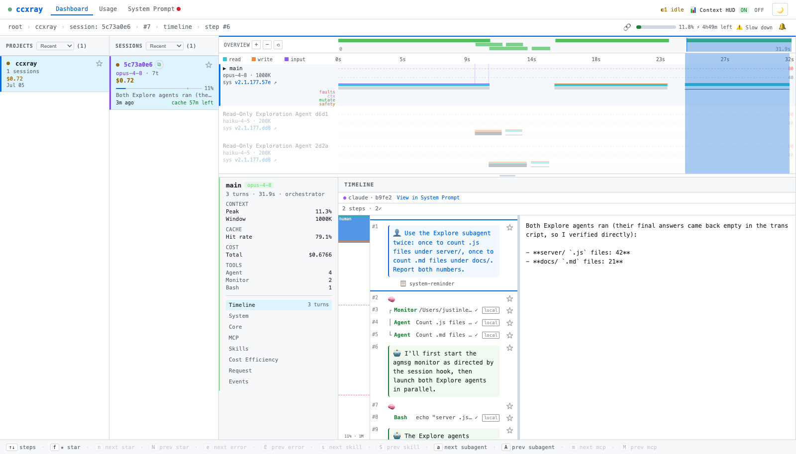
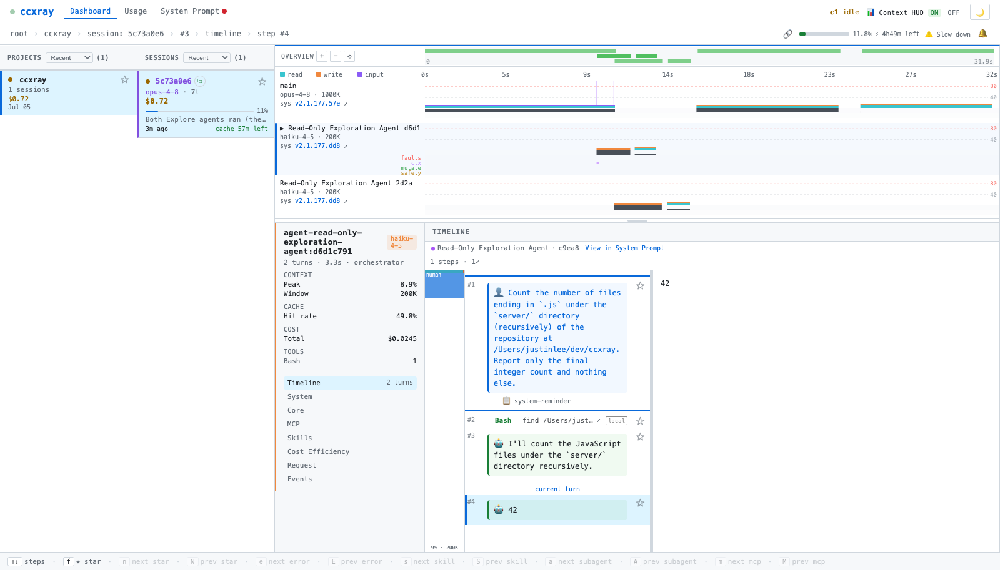
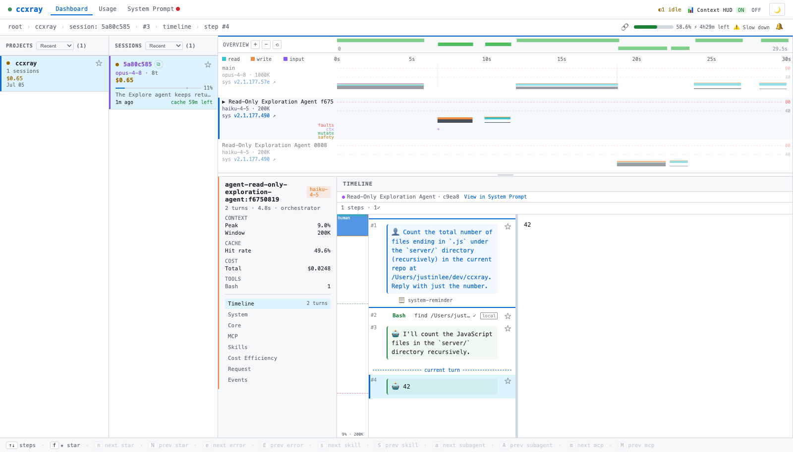

# Investigation — "selecting a subagent loses the contrast"

**Date:** 2026-07-05 · **Status:** diagnosed → fixed & verified
**Area:** `public/workflow-timeline.js` swimlane focus/dim · related to the workflow-ux state audit (#136–140)

## Symptom (user report)

> Pre-selecting `main` on first open is fine. The confusion is that **after clicking a
> subagent lane, that strong contrast effect disappears.**

On load one lane clearly "pops" and the others fade; after clicking a subagent lane, the
subagent is selected but nothing fades — the dramatic contrast is gone.

## What actually happens (verified in-browser)

There are **two independent emphasis mechanisms**, driven by **different state**:

| Mechanism | Driven by | Visual | Strength |
|---|---|---|---|
| Lane selection | `wfState.selectedLane` | accent bar + expanded height + event-track labels | weak (subtle) |
| **Cross-lane dim** | `wfState.selectedTurnId` (**a locked turn**) | every *other* lane → `opacity: 0.35` | **strong (dramatic)** |

The dim is bound to the *locked turn's* lane, not to the *selected* lane
(`public/workflow-timeline.js:693`):

```js
var lockedLi = -1;
if (wfState.selectedTurnId && wfState.turnIndex) {
  var lockHit = wfState.turnIndex.get(wfState.selectedTurnId);
  if (lockHit) lockedLi = lockHit.laneIdx;
}
var laneCls = function(li){ return 'wf-lane' + (lockedLi >= 0 && lockedLi !== li ? ' dim' : ''); };
```
CSS (`public/style.css:699`): `#wf-timeline g.wf-lane.dim { opacity: 0.35; }`

### The sequence that causes the confusion

1. **On load**, the URL restore leaves a **locked turn** in `main` (`selectedTurnId` set) *and*
   `selectedLane = main`. So both mechanisms fire: main is accented/expanded **and** every other
   lane is dimmed to 0.35 → the strong contrast the user sees.
2. **Clicking a subagent lane's empty chart area** runs the "select lane, no lock" handler, which
   sets `selectedTurnId = null` (**unlocks**). The cross-lane dim switches off → all lanes return
   to full opacity. The subagent *is* selected (accent + expand + agent-card/detail all move to it),
   but it only gets the **weak** emphasis; the **strong** dim is gone.

So it isn't a selection bug — the dominant visual signal is tied to *turn-lock*, and selecting a
lane by its empty area actively removes the lock.

## Evidence

**Load — a main turn is locked → other lanes dimmed to 0.35 (strong contrast):**



**After clicking the subagent lane's chart area — turn unlocked → all lanes full opacity
(contrast gone), subagent selected but only weakly emphasized:**



In-browser probes for the second state:
- `selectedLane` → `agent-read-only-exploration-agent:d6d1c791` (moved ✓)
- `selectedTurnId` → `null` (unlocked — this is why the dim vanished)
- subagent lane#1 height → **85px** (expanded, `WF_LANE_H_SEL`); main lane → **60px** (collapsed)

This is the same root-cause shape as the audit itself: **one concept ("focus") driven by two
different pieces of state**, so the two don't stay in sync.

## Decision & fix

**Make the cross-lane dim follow `selectedLane`, not (only) `selectedTurnId`**, so *any* focused
lane — the default `main` on load, or a clicked subagent — consistently recedes the others. The
locked turn keeps its second-layer signal (intra-lane spotlight + `#wf-cursor` band).

```js
// workflow-timeline.js ~L693 — dim follows the focused lane
var focusLi = wfState.selectedLane ? wfState.lanes.indexOf(wfState.selectedLane) : -1;
var laneCls = function(li){ return 'wf-lane' + (focusLi >= 0 && focusLi !== li ? ' dim' : ''); };
```

**Decided:** soften the dim opacity from **0.35 → 0.55** (`public/style.css:699`), because dimming
on plain lane-selection (not just on a deliberate turn-lock) is more frequent and 0.35 felt too
heavy for a browsing selection. The `:hover` un-dim (currently `0.7`) stays.

```css
#wf-timeline g.wf-lane.dim { opacity: 0.55; transition: opacity 0.15s; }
#wf-timeline g.wf-lane.dim:hover { opacity: 0.7; }
```

### Trade-off recorded

- ✅ Removes the load-vs-click inconsistency; `selectedLane` becomes the single source of truth
  for focus (matches the audit's direction).
- ⚠️ Plain browsing-selection now dims the rest too; 0.55 (vs 0.35) keeps unfocused lanes legible
  so the view doesn't feel over-suppressed.

## Implemented

Both changes landed on `fix/wf-state-audit`:
- `workflow-timeline.js`: new `_wfFocusLaneIdx()` (single source of truth); the render-time
  `laneCls` and the hover-clear `_wfClearSpotlight` both dim by focus lane instead of locked turn.
  The dead `lockedLi` computation is removed.
- `style.css`: `.wf-lane.dim` opacity `0.35 → 0.55`.

Verified in-browser: clicking a subagent lane's empty chart area (no turn locked) now sets
`_wfFocusLaneIdx()` to that lane, the selected lane is undimmed, and every other lane carries
`.dim` at computed `opacity: 0.55`:



Compare with `SEL-2-subagent-clicked.png` above (pre-fix), where selecting a subagent left all
lanes at full opacity and the contrast vanished.
