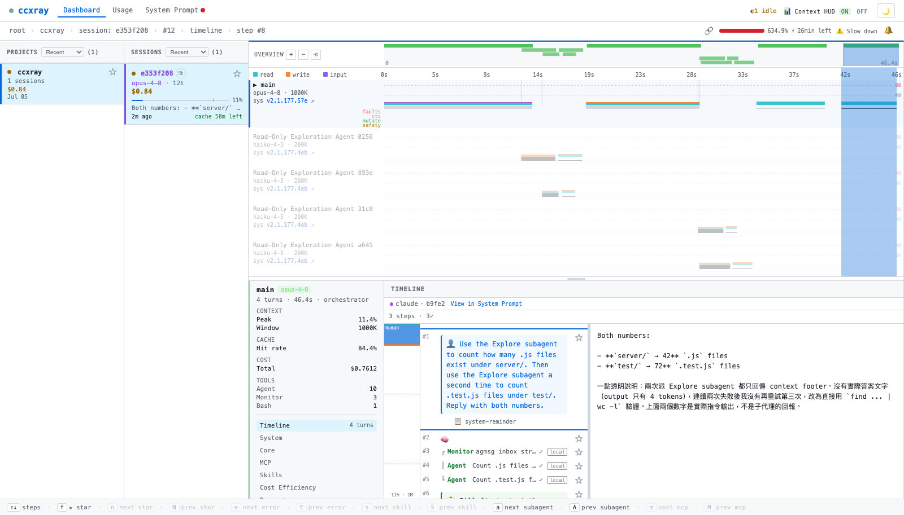
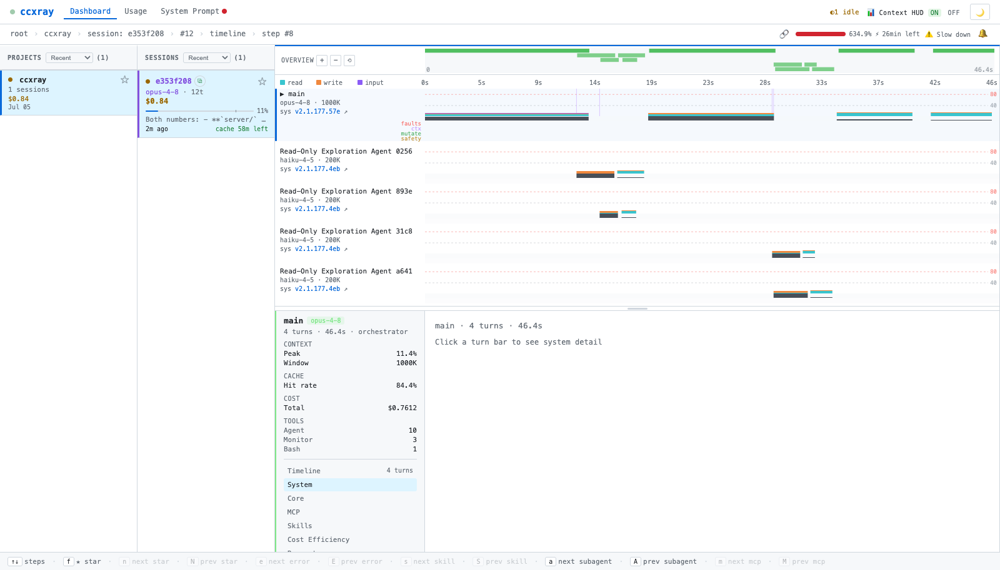
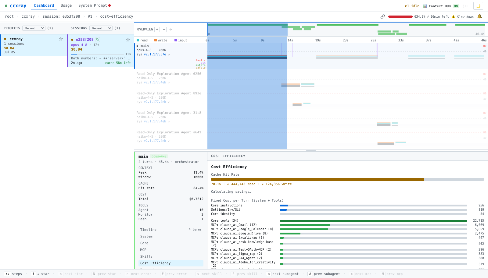
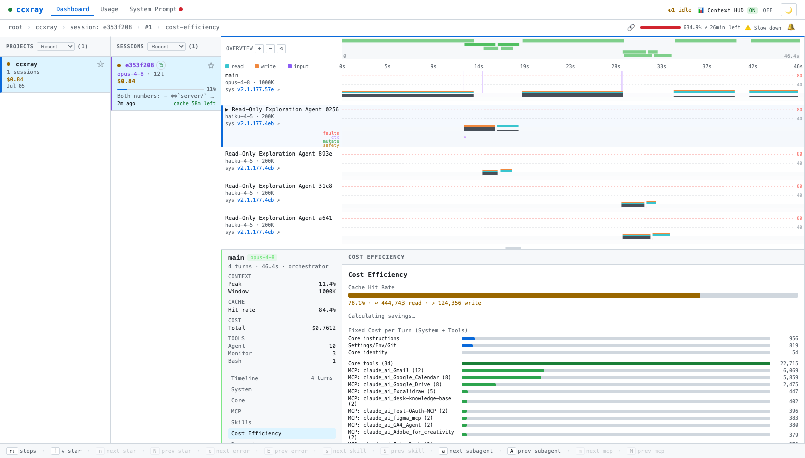
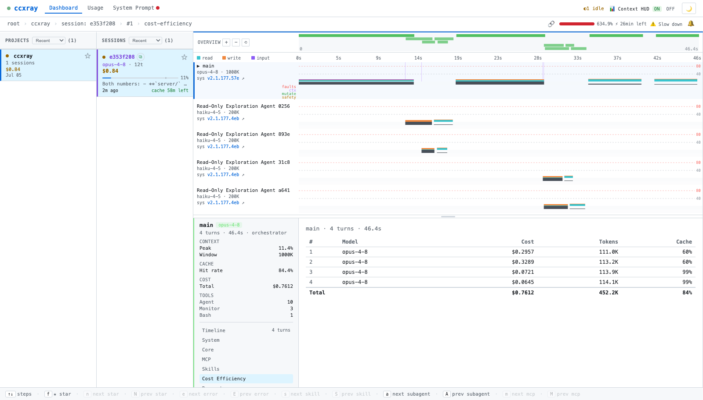
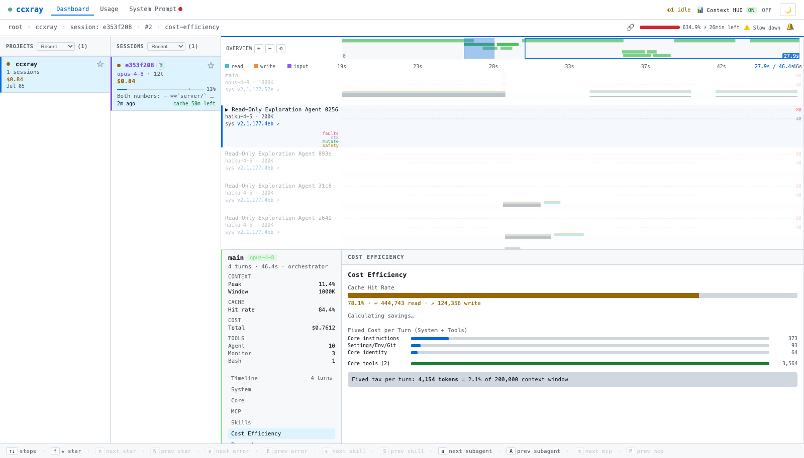
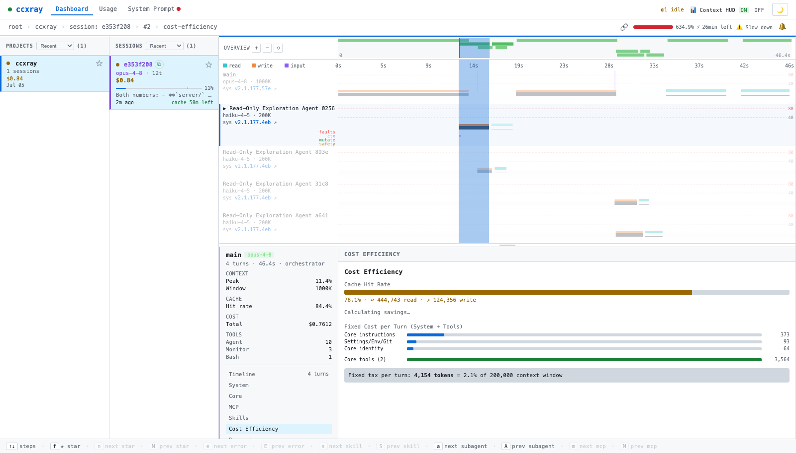

# Workflow-view state-audit — automated smoke report

**Date:** 2026-07-05 · **Branch:** `fix/wf-state-audit` (6 commits, unpushed) · **Result: 10 / 10 checks PASS**

## How it ran

- Local repo server (`node server/index.js --port 5603`), isolated `CCXRAY_HOME`, upstream → real Anthropic.
- Real traffic: `claude -p` through the proxy running two Explore subagents → a live session with
  **5 lanes** (`main` opus-4-8 + 4 `Read-Only Exploration Agent` lanes on haiku-4-5), 12 turns.
- Headless Chrome (CDP) drove the dashboard; each check reads `wfState` live and captures a screenshot.
  The driver functions exercised are the exact ones the UI `onclick` handlers call.

Session used: `e353f208`, lanes `main`, `agent-read-only-exploration-agent:{0256ca21, 893e…, 31c8…, a641…}`.

### Baseline — the rendered workflow view

Five lanes, OVERVIEW minimap, agent card + section nav, timeline detail:

## Results at a glance

| # | Issue | Check | Result |
|---|-------|-------|--------|
| T1 | #136 | global `selectedSection` tracks `wfState.selectedSection` (lane-summary branch) | ✅ `=system` |
| T1 | #136 | match still holds after a locked-turn section switch | ✅ `=cost-efficiency` |
| T2 | #139 | every lane `.key` is unique | ✅ |
| T2 | #139 | selecting lane #2 matches exactly **one** lane by key | ✅ `matched=1` |
| T3 | #140 | cost-efficiency row `onclick` calls `wfLockTurn(` (not raw `selectedTurnId=`) | ✅ |
| T3 | #140 | `wfLockTurn` keeps expanded lane == locked-turn lane (A==B) | ✅ |
| T4 | #138A | `wfIsZoomed()` helper exists (single source of truth) | ✅ |
| T4 | #138A | `wfIsZoomed` false at full range, true when zoomed | ✅ `full=False zoomed=True` |
| T5 | #138C | brush-zoom guard raised to `>= 2000` (source check) | ✅ |
| T6 | #138B | tail-follow slides a **fixed span** (viewT1 tracks tail, span unchanged) | ✅ `span0=span1=46429` |

---

## T1 — #136 section highlight == rendered detail

Nav highlights **System**; the detail pane renders the matching system lane-summary
("Click a turn bar to see system detail"). Highlight and content agree.

After locking a turn and switching to **Cost Efficiency**, the global still equals
`wfState.selectedSection` — no desync across the branch:

## T2 — #139 similar lane names don't co-select

Two Explore lanes share the same model + a near-identical label, yet all 5 lane `.key`s are unique.
Selecting lane #2 matches **exactly one** lane (no multi-expand / no mis-hit):

## T3 — #140 expanded lane == locked-turn lane (A==B)

The rendered cost-efficiency table now wires each row to `wfLockTurn(...)` (verified: `wfLockTurn(` present,
raw `selectedTurnId=` absent):

Locking a turn that lives in lane #2 correctly moves `selectedLane` to that lane
(`selectedLane=agent-read-only-exploration-agent:0256ca21`) — expand == lock:

## T4 — #138A wfIsZoomed helper (pure refactor)

`wfIsZoomed()` present; false at full range, true when zoomed. Zoomed state shows the OVERVIEW viewport
rect + the detail redraw (no behavior change vs. before):

## T5 — #138C tiny brush doesn't over-zoom

Source check: the brush-zoom commit guard is `t1 - t0 >= 2000` (was `> 1000`), matching the shared 2000 ms
floor. (No screenshot — the brush path lives in a closure not reachable by a single synthesized event; the
committed unit tests drive the same logic.)

## T6 — #138B live-follow slides like tail -f

Simulating a later turn while parked at the tail: `viewT1` tracks the new `tMax` and the span stays
`46429` ms (slides, does not grow) — the tail -f behavior you approved. View restored to full range after:

---

## Coverage gaps (honest)

- **#137 (live child-session filing)** is not exercised here: it needs a *genuinely separate* child session
  (distinct `sessionId`, `parentSessionId` = viewed session) streaming live. Explore subagents share the
  parent `session_id` (the already-correct `isDirectSession` path). #137 is covered by unit tests
  (`test/workflow-timeline.test.js`), not by this browser run.
- **T5 / T6** are verified by source/console logic rather than a raw mouse-drag gesture (brush and follow
  paths live in closures not reachable by a single synthesized event). The committed unit tests drive the
  same logic.

_Screenshots and this report are uncommitted artifacts under `docs/wf-state-smoke/`; delete freely._
