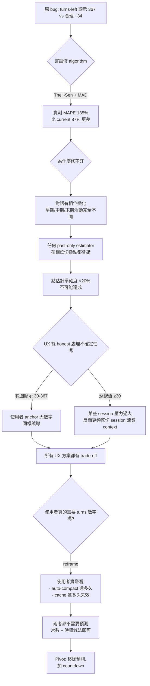

# Design: Remove Prediction, Add Countdowns

## Context

### 為什麼從「修預測」翻成「移除預測」

一個 bug report 的 5-why 分析引導到「單一小窗口 × 無 sanity cap × compaction 偵測不可靠」，當時認為可以修。**實測後發現更深層問題**：



### 資料層的意外發現

驗證 `usage.sum` vs `tokens.total` 時發現：

- Claude Code 自己的 compaction summary 報 `85.5% (170,986 / 200,000)`
- `usage.sum` 實測 = **170,986**（0 誤差）
- `tokens.total` 實測 = **127,541**（差 25%）

**意義**：Claude Code 內部用 billing 口徑（= `usage.sum`）計算 context %，不是用 tokenizer 口徑。

原本以為 ccxray 也錯了（用 tokens.total），**但讀 code 後發現 ccxray `entry-rendering.js:280-287` 從一開始就是用 `usage.sum`**。Dashboard ctx % 本來就對。

這個校正讓計畫進一步簡化（砍掉原本要加的「Issue 10：改 ctx % 計算」）。

## Goals / Non-Goals

### Goals

- **移除誤導**：刪掉 87% MAPE 的 predictor
- **加上 actionable 訊息**：Cache TTL countdown + auto-compact ref line
- **誠實**：不做預測，不給精確度 <20% 的數字
- **漸進**：env var 先行，UI settings 延後
- **可 revert**：新功能加 feature flag / env（壞了能關）

### Non-Goals

- **不重新設計 session card 整體排版**（只在既有底部加/減一行）
- **不做 auto-compact 的 turns 預測**（這是本 change 放棄的方向）
- **不整合 `context-plan-selector`**（那是 1M vs 200K 的 context window 判定；本 change 是 cache TTL 設定；UI 層未來可合併但本次不動）
- **不做 settings UI**（env var 足夠；v2 再考慮）
- **不改 server 端 tokenization**（lazy tokenization 不是 blocker）

## Decisions

### D1. 完全移除 `predictRemainingTurns`，不保留為 fallback

**選項**：
- (a) 全刪
- (b) 保留註解掉供未來參考
- (c) 保留但 feature flag 隱藏 UI

**選 (a)**。理由：
- 違反 CLAUDE.md「Delete Before You Build」— 死程式碼累積
- Git history 保有完整演進，需要可 revert 特定 commit
- 若未來真要做預測，新做法（例如 ML、歷史資料 prior）與當前實作差異大，保留反而混淆

### D2. Cache TTL 來源單一環境變數 `CCXRAY_PLAN`

**選項**：
- (a) env var only
- (b) Settings file `~/.ccxray/config.json`
- (c) localStorage（per-browser）
- (d) Topbar dropdown + localStorage + env override

**選 (a)** for v1。理由：
- 使用者 plan 基本不變（換 plan 頻率 ~1/year）
- env var 可在啟動 script 寫死，無 UI 也能用
- 省掉 HTTP endpoint + race condition + 跨 hub 同步等複雜度
- v2 再升級成 (d)

**預設規則**：
```
planRaw = process.env.CCXRAY_PLAN?.toLowerCase()
plan = planRaw === 'max' ? 'max'
     : planRaw === 'pro' ? 'pro'
     :                     'api-key'   // 預設最保守 5m TTL

cacheTtlMs = plan === 'max' ? 3_600_000 : 300_000
```

Topbar 顯示：`Plan: Max · TTL 1h` 小字（使用者一眼看到當前值）。

### D3. Active session 判定 + 分層節流

```
active = (now - lastReceivedAt) < cacheTtlMs
```

只有 `data-active="1"` 的 session card 會被 countdown ticker 掃到。

**分層節流規則**：

| remaining | 更新頻率 | 顯示格式 | CSS class |
|---|---|---|---|
| `> 300s` | 每 10s | `47m` | `.cache-far` |
| `60–300s` | 每 1s | `4:32` | `.cache-near` |
| `< 60s` | 每 1s | `0:42` | `.cache-close`（紅+閃爍） |
| `< 0` | 停止更新 | `cache expired` | `.cache-expired` |

單一 `setInterval(1000)` at app level，每 tick 做三件事：
1. 掃 `[data-active="1"]` session cards
2. 計算每個的 remaining，決定是否需改 textContent（10s/1s gating）
3. 若 remaining < 0 → 移除 `data-active`，切 expired class

**效能**：純 `textContent` 更新不觸發 layout；n ≤ 3 activ sessions 實測 < 1ms per tick。

### D4. Dormant 恢復處理

**問題**：使用者離開 2 小時後回來（Max plan 1h TTL 已過期）。第一個新 turn 來時，naïvely 會顯示 `cache 1:00:00`，但實際 cache 早已失效。

**解法**：
```
if (interval > cacheTtlMs && newTurnArrives) {
  card.textContent = 'cache rebuilding'
  // 等下一輪 response，從 usage 確認:
  // 若 cache_creation > 0.5 * input_total → 確認是冷啟動
  // 下一輪開始才 countdown
}
```

**觀察指標**：`cache_creation_input_tokens / (cache_creation + cache_read + input)` — 若 > 50% 代表 cache 被重建。

### D5. Auto-compact 參考線改**靜態視覺**而非**countdown**

原計畫：顯示 `~15 turns to compact`（依賴 rate estimator）。
改為：僅在 ctx bar 畫 83.5% 位置的垂直線 + tooltip。

**理由**：
- 無預測 = 無 MAPE 風險
- 使用者自己看「ctx 72% vs 線在 83.5%」就知道還有餘裕
- 已經在 session card 下方會顯示 `latestMainCtxPct`（e.g. 72%），參考線給視覺 anchor
- 若線色改紅（ctx 超過 83.5%）→ 直接成為 actionable 警示

**實作**：
```css
.ctx-bar { position: relative; }
.ctx-bar::after {
  content: '';
  position: absolute;
  left: 83.5%;
  top: 0; bottom: 0;
  width: 1px;
  background: var(--dim);
}
.ctx-bar.over-compact::after { background: var(--red); }
```

`AUTO_COMPACT_PCT` 設為 named const（未來 Anthropic 調門檻時單點改）。

### D10. Shared auto-compact landmark via CSS custom property

The `~83.5%` auto-compact threshold is a physical constant of Claude Code,
not a per-level decision. It should appear as the same tick position on
every level of the context visual hierarchy (L1 session card, L2 turn card,
L3 turn detail).

**Single source of truth** — `/_api/settings` returns `autoCompactPct`. On
load, `public/settings.js` sets a CSS custom property on `:root`:

```js
document.documentElement.style.setProperty(
  '--compact-threshold',
  (settings.autoCompactPct * 100) + '%'
);
```

All tick positions across L1/L2/L3 read `left: var(--compact-threshold)`.
If Anthropic adjusts the threshold later, the server constant changes once
and the CSS variable cascades.

**Prevents**: Pre-mortem F7 (scattered `83.5%` literals drift out of sync).

### D11. Level-specific color thresholds (don't over-unify)

L1 session card and L3 turn detail measure **current session cumulative
ctx%** — answering "am I near compact?" Same metric, same color rules:

- `≥ 83.5%` → red (over auto-compact threshold)
- `≥ 75%`   → yellow (near compact)
- `< 75%`   → dim (healthy)

L2 turn card ALSO shows cumulative ctx% at that turn, but the **use case is
different**: scanning turns within a session to find anomalies. If L2 used
the same threshold, every turn after the session crosses 83.5% would light
up red, producing a wall of warning colors and defeating the purpose of
per-turn scanning.

L2 keeps its existing thresholds:

- `> 95%` → `ctx-critical` red (this turn is in danger)
- `> 85%` → `ctx-warning`  yellow (this turn is getting high)

**Prevents**: Pre-mortem F1 (red fatigue on L2 in late-session turns).

**Reference interpretation**:
- L1/L3 color: "decision signal" (should you act?)
- L2 color: "anomaly detector" (is this turn unusual?)

### D12. Recent-gate for L1 historical sessions

L1's red/yellow coloring applies only to **recent** sessions. A session
whose `lastReceivedAt` is more than 1 hour ago shows dim-grey regardless
of its ctx% at termination. The ctx bar itself still renders (informational),
but the alert badge does not light up, and the cache countdown row is omitted.

```
recent = (now - sess.lastReceivedAt) < 60 * 60_000
if recent:
  red    if ctxPct ≥ 83.5%
  yellow if ctxPct ≥ 75%
  dim    otherwise
else:
  dim always  (session is historical, no action required)
```

**Prevents**: Pre-mortem F2 (sea-of-red across the historical session list
when scanning past work, undermining the signal value of red).

**1h threshold reasoning**: aligns with the longest plan cache TTL (Max 1h).
Once even Max cache has expired, the session can't be "continued" without
a cold-start rebuild, so coloring its ctx as urgent is misleading.

### D7. Auto-detect plan via `ephemeral_5m/1h_input_tokens`

**觀察**：Anthropic response usage 含 `cache_creation.ephemeral_5m_input_tokens` 與 `ephemeral_1h_input_tokens`，分別記錄寫入 5m / 1h cache 的 tokens。Claude Code 依據訂閱方案選擇 TTL。

**實測（scan 500 筆 `_res.json`）**：
```
473 筆有 cache_creation 資料
  ephemeral_5m > 0:    0 筆  (0.0%)
  ephemeral_1h > 0:  432 筆  (91.3%)
  兩者皆 0:            41 筆  (8.7%)  ← 純讀 cache，不寫
```

100% 清晰訊號，符合使用者 Max plan 1h TTL。

**演算法**：
```js
function detectPlan(recentEntries /* 取最近 100 筆 */) {
  const withCache = recentEntries
    .map(e => e.usage?.cache_creation)
    .filter(Boolean)
    .slice(-20);
  if (withCache.length < 5) return { plan: null, confidence: 'insufficient' };

  const has1h = withCache.some(c => (c.ephemeral_1h_input_tokens || 0) > 0);
  const all5m = withCache.every(c =>
    (c.ephemeral_1h_input_tokens || 0) === 0 &&
    (c.ephemeral_5m_input_tokens || 0) > 0
  );
  if (has1h) return { plan: 'max', confidence: 'high', source: 'auto' };
  if (all5m) return { plan: 'pro', confidence: 'high', source: 'auto' };
  return { plan: null, confidence: 'low' };  // mixed → silent regression
}
```

**5x vs 20x 無法從 cache 訊號分辨**（兩者 TTL 同為 1h）。差別在 5h window 配額，需要 `anthropic-ratelimit-tokens-limit` header 才能區分 → 見 D8。

**預設 Max 歸類為 5x**：避免 ROI 被誇大（若實際是 20x，會顯示較保守值）。使用者可用 `CCXRAY_PLAN=max20x` 覆寫。

### D8. Quota panel 與 plan 連動（`server/plans.js`）

**現況**：`server/cost-budget.js:8-9` 兩個硬編常數：
```js
const TOKEN_LIMIT = 220_000;     // → Max 20x 數值（Max 5x 使用者會看錯）
const SUBSCRIPTION_USD = 200;    // → Max 20x 數值（ROI 被低估一半）
```

使用處：
- `server/routes/costs.js:54` — `tokenLimit = liveLimit || TOKEN_LIMIT`（fallback）
- `public/quota-ticker.js:37` — `roi = monthly_cost / 200`
- `public/quota-ticker.js:45` — `capacity = 220000 / 300` tokens/min

**方案**：建立中央 plan config，從 detector 決定參數。

```js
// server/plans.js
const PLAN_CONFIG = {
  'pro':     { tokens5h:  50_000, monthlyUSD:  20, cacheTtlMs:   300_000, label: 'Pro'     },
  'max5x':   { tokens5h: 220_000, monthlyUSD: 100, cacheTtlMs: 3_600_000, label: 'Max 5x'  },
  'max20x':  { tokens5h: 880_000, monthlyUSD: 200, cacheTtlMs: 3_600_000, label: 'Max 20x' },
  'api-key': { tokens5h:       0, monthlyUSD:   0, cacheTtlMs:   300_000, label: 'API key' },
};
```

> 數字校準：等下一輪 Claude Code 請求捕獲 `anthropic-ratelimit-tokens-limit` header 後實測。暫定 5x = 220K（複用既有硬編常數值）、20x = 4× 5x。

**新 endpoint `/_api/settings`**：
```json
{
  "plan": "max5x",
  "label": "Max 5x",
  "source": "auto-detected|env|default",
  "confidence": "high|low|insufficient",
  "cacheTtlMs": 3600000,
  "tokens5h": 220000,
  "monthlyUSD": 100
}
```

**Live rate limit 優先**：若 `anthropic-ratelimit-tokens-limit` header 有值（`source: 'live'` in cost API），**以 live 為準**，plans.js 僅為 fallback。

**API key 的 ROI 處理**：`monthlyUSD = 0` → UI 隱藏 ROI badge（除零不顯示比算錯好）。

**捕獲 rate limit headers 到 log（future 校準 5x vs 20x）**：
- 當前 headers 只存記憶體（`store.rateLimitState`）
- 新增：每當收到 headers 時 append 一行到 `~/.ccxray/ratelimit-samples.jsonl`
  `{ "ts": "...", "tokensLimit": X, "inputLimit": Y }`
- 累積 50 筆後，檢查 tokensLimit 的 distribution → 若只有一個模式 → 確認單一 plan；若雙峰 → 偵測到 plan 切換

### D9. Cache expiration notification 分流

**Layer 1（所有方案，passive）**：
- Browser tab title flash `⚠ ccxray` 當任一 active session cache < 30s
- Session card border 閃爍
- 零 permission

**Layer 2（opt-in / plan-gated）**：
- Max plan 預設 **ON**，通知 lead time **5 分鐘**
- Pro / api-key 預設 **OFF**（opt-in 後 lead time 60 秒）
- 使用 Browser Notification API
- 首次 permission request 在使用者 toggle 時才觸發
- Dedupe：同一 cache cycle 僅通知一次
- `CCXRAY_CACHE_NOTIFY=on|off` 可覆寫

**通知內容（Max plan 5min lead）**：
```
Title: ccxray · cache expiring in ~5 min
Body:  Session 317f419d · Max plan 1h cache
       Send a prompt to refresh, or let it expire.
```

### D6. Silent regression 偵測的 FP 防護

**觸發條件**：
```
interval_seconds > 300           (> 5 min gap)
AND cache_read < 1000            (基本上沒命中)
AND cache_creation > 10000       (大量重建)
AND NOT /compact /clear /model  (排除使用者行為)
```

**累計 + cooldown**：
- 同 session 累計 3 次滿足條件才 raise flag
- Flag raised 後 24h 內不重複
- Flag 存 `~/.ccxray/hub.log` + topbar banner（可 dismiss）

**誤報來源清單（須排除）**：
- `/compact` `/clear` `/model` 主動行為
- Claude Code version upgrade（cache key 變）
- Anthropic 後端 rolling eviction（無法區分，但低機率）
- 使用者長時間閒置後回來（已由 dormant 恢復處理）

## Risks / Trade-offs

### R1. 移除 `turns-left` = breaking change

**風險**：使用者已習慣（即使誤導也建立 mental model）。

**對策**：
- CHANGELOG 顯著標示
- 一個 release 內的 tooltip / banner 提示：「~~N turns left~~ removed — see ctx% + 83.5% line instead」
- 新 countdown 填補 actionable 訊息空缺

### R2. Cache TTL 不一定精確（Anthropic 後端可能 rolling evict）

**風險**：UI 顯示 `47:23` 但實際 cache 在 30m 就被擠掉。

**對策**：
- 措辭為「should expire in ≤47:23」而非絕對值
- Silent regression 偵測（D6）捕捉系統性偏差
- 未來可加「observed TTL」統計（cache_read 命中率下降對應的實際 TTL 中位數）

### R3. Auto-compact 閾值是 Claude Code client-side 決策

**風險**：83.5% 是外部觀察的近似，Claude Code 內部邏輯可能更複雜（buffer 動態調整、tool-use 前瞻等）。

**對策**：
- Tooltip 措辭：`triggers at ~83.5%`（帶「~」）
- 被動校準：每當觀察到實際 compact 事件（新 turn 的 `msgCount` 大幅下降、ctx 突然降），記錄當時 %，累積用於未來調整 named const
- 不顯示「還 N turn」避免過度承諾精度

### R4. env var 無 UI = 新使用者難發現

**風險**：新使用者不知道要設 `CCXRAY_PLAN`，永遠看到 5m TTL（預設）。

**對策**：
- Topbar 顯示目前 plan + TTL 值：`Plan: api-key · TTL 5m`
- 一次性 nudge：若 `CCXRAY_PLAN` 未設 + 觀察到 `cache_read > 0` in last 24h → topbar 提示「set `CCXRAY_PLAN=max` if you're on Max plan」

### R6. Plan auto-detect 在新 install 無歷史資料

**風險**：新 user install，尚無 cache_creation 資料，detector 回 `insufficient` → fallback 到 api-key → 顯示 5m TTL，Max 使用者前 20 turns 看錯誤 countdown。

**對策**：
- 若 env `CCXRAY_PLAN` 有設 → 直接生效，不等 detector
- 若無 → 顯示 `Plan: API key (default) · TTL 5m · auto-detecting...`，前 20 turn 後自動升級
- Detector 判定成功後 SSE 推送一次 `settings_changed` 事件，全 UI 重 render

### R7. Plan detector 誤判 silent regression 為 Pro

**風險**：Max 使用者若遇到 silent regression，所有 cache writes 變 5m → detector 推論為 Pro → 顯示 5m TTL，使用者 confused。

**對策**：
- Detector 與 Issue 6 silent regression 協作：若 Issue 6 偵測到可疑 regression pattern → 標 detector confidence 為 low → 顯示 `Plan: ? (detecting anomaly)` 並 fallback 到 env 或 default
- 使用者可強制 `CCXRAY_PLAN=max` 覆寫

### R8. L2 tick visibility on 3px bar

**風險**：L2 `turn-ctx-bar-bg` is 3px tall. A 1px vertical tick at 83.5%
may be visually indistinguishable from the cache-read/write/input color
segments it overlays.

**對策**：
- Tick height 5–6px, `overflow: visible` on the bar's parent
- Tick color contrasts with segments (use dim foreground + thin dark stroke)
- Add `title="auto-compact at ~83.5%"` so hover confirms semantic

### R9. Color unification tempting but harmful at L2

**風險**：Future PRs may see L2 using `>95` / `>85` while L1/L3 use `83.5%/75`
and try to "simplify" by unifying. This defeats the per-turn anomaly
detection purpose of L2 color.

**對策**：
- Decision D11 explicitly documents why L2 is different
- Comment inline at `entry-rendering.js:391`:
  `// per-turn anomaly thresholds; see Decision D11 — do not unify with L1/L3`
- `turn-ctx-bar-bg` and `si-ctx-bar` use different CSS class prefixes;
  resist refactoring into a shared class.

### R5. setInterval 可能 leak 在 session DOM 被 virtualize 的未來

**風險**：目前 session list 無 virtualization；若未來加入，DOM 節點可能被 detach 但 `data-active` 仍在 ticker 的 query 範圍。

**對策**：
- Ticker 用 `document.querySelector` 每次重查，不快取 DOM reference
- Virtualization 加入時須同步更新 active tracking

---

## Visual Reference: Session Card Before / After

### Current UI（with misleading turns-left）

```
╭──────────────────────────────────────────╮
│ ● 317f419d  ★  ⊗                         │  ← si-row1
│ haiku-4-5 · 167t · $0.423                │  ← si-row2
│ Bash·45  Read·30  Edit·15                │  ← si-tools
│ 2h ago                          [ 85% ]  │  ← si-row3
│ ≈367 turns left                          │  ← 🔴 TO BE REMOVED (MAPE 87%)
╰──────────────────────────────────────────╯
```

### New UI — Scenario 1: Active, cache healthy (>5m remaining)

```
╭──────────────────────────────────────────╮
│ ● 317f419d  ★  ⊗                         │
│ haiku-4-5 · 167t · $0.423                │
│ Bash·45  Read·30  Edit·15                │
│ 2h ago         [ 85% / compact ~84% ]    │  ← + "compact ~84%" anchor
│ ▰▰▰▰▰▰▰▰▰▰▰▰▰▰▰▰▰┃▰▱▱▱                │  ← NEW: ctx bar + 83.5% ref line
│ cache 47:23 ⏱                            │  ← NEW: dynamic countdown (10s tick)
╰──────────────────────────────────────────╯
```

### New UI — Scenario 2: Active, cache critical (<1m)

```
│ cache 0:42 ⏱  ⚠                          │  ← red + blink + warn icon
```

### New UI — Scenario 3: Cache expired

```
│ cache expired                            │  ← static, dim color
```

### New UI — Scenario 4: Dormant recovery

```
│ cache rebuilding...                      │  ← transient; observe next response
      ↓ next response: cache_creation > 50% total_input
│ cache 59:48 ⏱                            │  ← confirmed cold start, countdown resumes
```

### New UI — Scenario 5: Over auto-compact threshold

```
│ 30s ago        [ 87% / compact ~84% ] 🔴 │  ← ctx alert red
│ ▰▰▰▰▰▰▰▰▰▰▰▰▰▰▰▰▰▰┃▰▰▰▱                │  ← ref line + over-portion red
│ cache 47:23 ⏱                            │
```

### New UI — Scenario 6: Non-active historical session

```
╭──────────────────────────────────────────╮
│ ○ 14f53b68  ★  ⊗                         │  ← grey dot
│ opus-4-6 · 496t · $12.43                 │
│ Read·80  Bash·42  Grep·38                │
│ 3d ago         [ 67% / compact ~84% ]    │
│ ▰▰▰▰▰▰▰▰▰▰▰▰▰▱▱▱▱▱┃▱▱▱▱▱              │
│ (no cache countdown — session idle)      │  ← omit row entirely
╰──────────────────────────────────────────╯
```

### Change Matrix

| 欄位 | 現行 | 新版 |
|---|---|---|
| si-row1 | status dot + sid + pin + launch | **不變** |
| si-row2 | model · turns · cost | **不變** |
| si-tools | top-3 tools | **不變** |
| si-row3 | relative time + ctxAlert (`[85%]`) | +`/ compact ~84%` 認知錨點 |
| **[NEW]** ctx bar | ❌ | 1px thin bar + 83.5% `┃` 線 |
| **[REMOVED]** prediction row | `≈367 turns left` | 🗑️ 刪除 |
| **[NEW]** cache row | ❌ | `cache MM:SS ⏱` / `expired` / `rebuilding` |

### Space budget（以目前約 62px 高 card 為基準）

```
before:                         after:
┌─ 14px ─ si-row1       ┐       ┌─ 14px ─ si-row1       ┐
├─ 12px ─ si-row2       │       ├─ 12px ─ si-row2       │
├─ 12px ─ si-tools      │       ├─ 12px ─ si-tools      │
├─ 12px ─ si-row3       │       ├─ 12px ─ si-row3       │
└─ 12px ─ prediction    ┘       ├─  2px ─ ctx bar       │  ← NEW (thin)
                                └─ 12px ─ cache row     ┘
total: 62px                     total: 64px (+2px)
```

**High level**: cards grow by 2px to accommodate the thin ctx bar; the removed prediction row is swapped for the cache countdown row at same height.

### Color semantics（沿用既有 CSS vars）

```
dim      = var(--dim)       ｜ 一般資訊
yellow   = var(--yellow)    ｜ 警示（ctx > 80%、cache < 5m）
red      = var(--red)       ｜ 緊迫（ctx > 90%、cache < 1m、over-compact）
accent   = var(--accent)    ｜ 健康（ctx < 80%、cache > 5m）
```

**不引入新色**，所有新元素套用既有 CSS variables。
