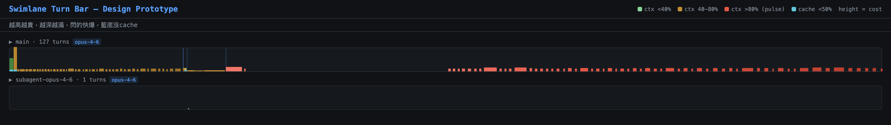
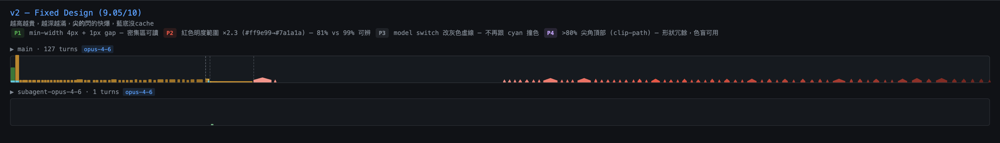
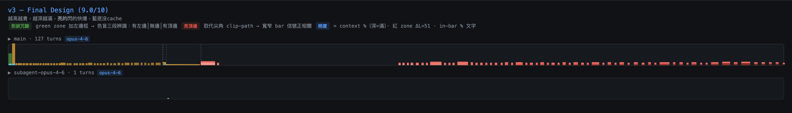
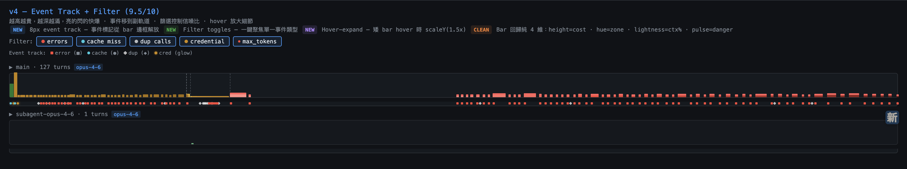
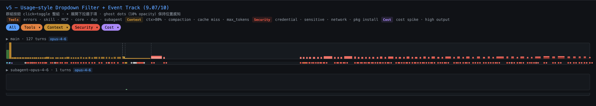
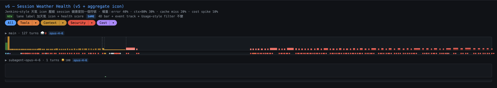
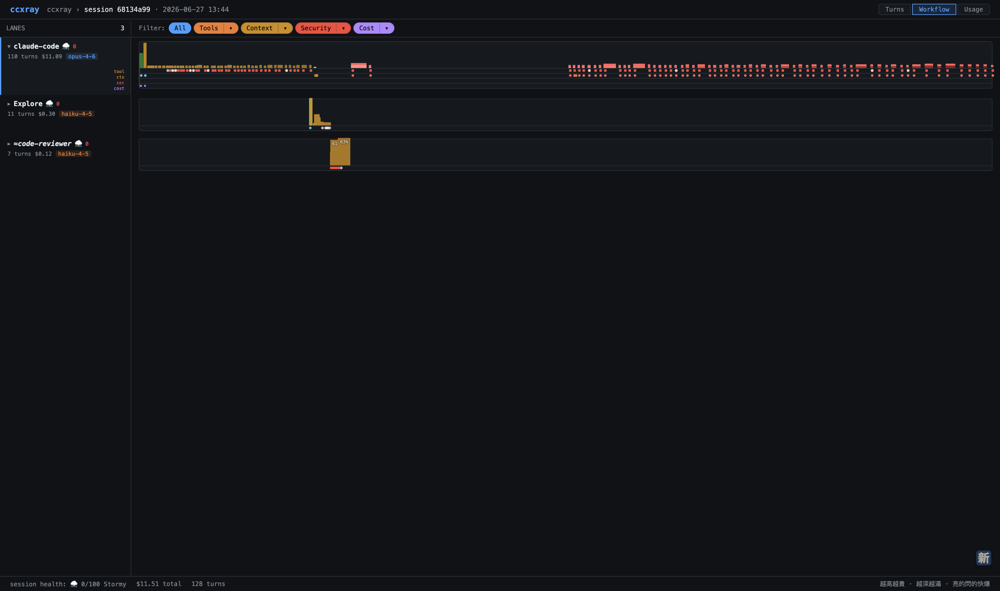
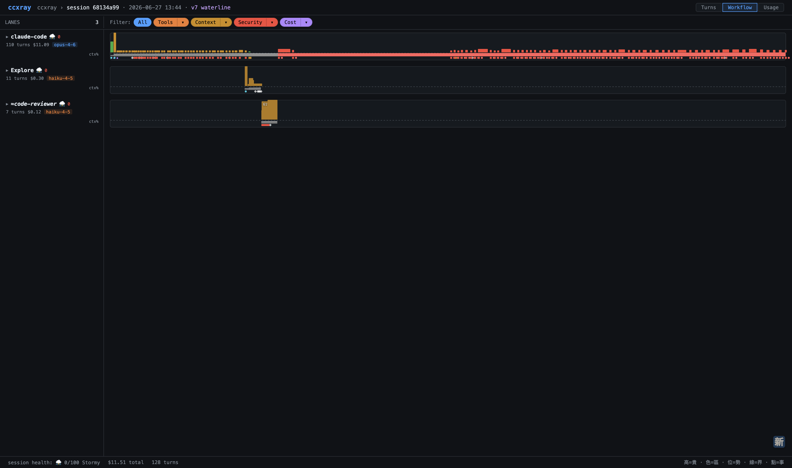
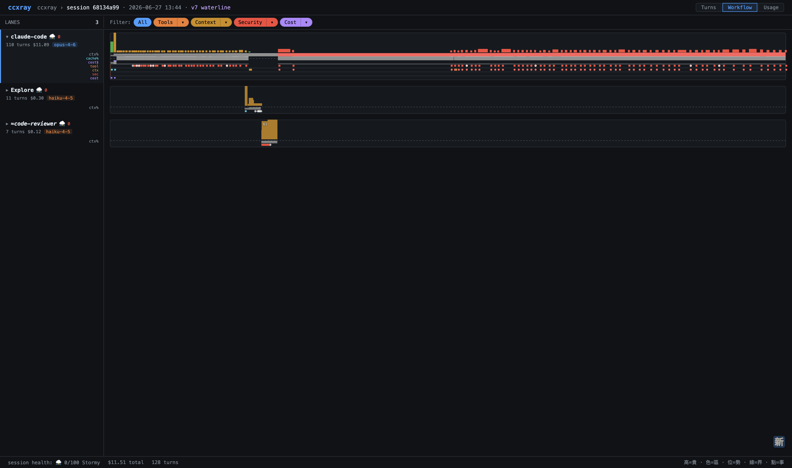

# Swimlane Turn Bar — v1→v7 設計決策全記錄

ccxray Workflow View（issue #91）turn bar 視覺系統的完整迭代史。
每版含截圖、evaluator 分數、關鍵批評原話、改版觸發原因。
教學重點：**看一個視覺編碼系統如何被對抗性評審逼著誠實**。

- Prototype：`turnbar-proto.html`（v1–v6 垂直排列）、`dashboard-v6.html`、`dashboard-v7-waterline.html`
- 評審機制：designer 與 evaluator 為**不同** subagent，每輪 evaluator 換新避免定錨；收案門檻 9.0/10
- 快速導覽見 `README.md`；實作守則見 memory `swimlane-turnbar-design`

---

## 評分方法論的演變（先讀這段）

早期用加權 UX 原則（Glanceability ×3、No expansion ×2…）。明度方案卡在 8.94 過不了 9.0 時，
coordinator 並行啟動 criteria-designer subagent 重新設計評分框架，轉向**任務導向**：

> 「1. **任務導向**：每個標準對應一個使用者會做的具體動作（『找到 X』『比較 A 和 B』），而非抽象的通道評估（『Mapping 是否天然』）
> 4. 色覺無障礙綁定任務：不是『色盲能看到顏色嗎』，而是『色盲能完成找最貴 turn 的任務嗎』—— 如果任務靠的是高度（非色彩通道），色盲不影響該任務
> 5. 寬度無關性獨立評分：前一輪的尖角問題（反相關）暴露出這是一個值得獨立追蹤的維度」

代表性標準：

> 「**找出最貴的 turn** | ×3 | 使用者能否在 2 秒內找到 lane 中 cost 最高的 3 個 turns？不需 hover，掃描即定位。」

v7 的 autoresearch 再往前一步：**evaluator 有數值宣稱就實算**（CIE L\*、色盲模擬、真實資料渲染）——
R2/R3 抓到的規格缺陷全是紙上推演抓不到的。

---

## v1 — 原版：3-zone 色 + cache/cost 展開行（7/10）



**設計**：bar 色 = context zone（綠/黃/紅）；選中 lane 展開 52px，多出 cache row（opacity=hit ratio）與 cost row（高度=相對 cost）。

**批評原話**：

> 「根本問題：這兩排試圖在 20px 高的空間裡用『同位置同寬的色條』傳達不同維度的資訊，但人眼在這個尺度下分不出 opacity 差異，也讀不出相對高度。」

**改版觸發**（使用者需求）：「一目了然，可以快速找到快取比例低、費用高的 turn，如果可以不展開直接看到比展開可能更好。」

→ 目標變成：**不展開，一條 bar 塞進 4 維**。三個候選編碼進入評審：

### 否決的三個編碼方案

| 方案 | 分數 | 死因（evaluator 原話） |
|------|------|------|
| Opacity=ctx% | 7.18 | 「低 opacity 綠色 bar 幾乎消失在深色背景上」「opacity 跟 color zone 干擾：低 opacity 的黃色 ≈ 高 opacity 的綠色。四維度裡有兩個交叉干擾」 |
| 電池 fill level | 6.56（最低） | 「battery metaphor 需要盯著單一 bar 看才能估算 fill level，不是 preattentive」「height 同時編碼 cost（整體高度）和 context（fill level）。兩個維度共用一個視覺通道」 |
| Tick mark | 8.11 | 「致命缺陷：太安靜」「2×2px 的白色 tick 在 4px 寬 bar 上佔了一半寬度……整體視覺效果是『條紋』噪音而非精確位置讀數」 |

勝出編碼：**lightness = context %**（深=滿），配 hue=zone、height=cost、pulse=danger → v2。

---

## v2 — Fixed Design：min-width + 紅 ΔL 擴大 + 尖角（9.05）



**四項修正**：

| 修正 | 解掉什麼 |
|------|---------|
| P1 min-width 2→4px + 1px gap | 密集區 60+ 個 2px 紅條融成噪音帶 |
| P2 紅 zone 明度範圍 ×2.3（#ff9e99→#7a1a1a，ΔL 22→51） | 81% 跟 99% 看起來一樣 |
| P3 model switch 改灰虛線 | 跟 cyan cache 底線撞色 |
| P4 >80% 尖角頂部（clip-path） | 形狀冗餘，色盲可用 |

**口訣**：「越高越貴，越深越滿，**尖的**閃的快爆，藍底沒cache」

---

## v3 — 尖角之死：亮頂邊取代（9.0）



**觸發**：尖角衝突嚴重度評估 7/10——

> 「**反相關問題確實存在**。4px 尖角在不同寬度 bar 上的表現：
> | 4px（短 turn）| 尖角 = 整個頂部 | 像針/三角形——過度醒目 | 通常不重要（便宜快速）
> | 40px（長 turn）| 微微凹槽 | 幾乎看不出來 | **最重要**（貴、耗時）」

**教訓（本系列最重要的一條）**：編碼的信號強度不能依賴另一個自由變數。尖角強度 ∝ 1/bar寬，恰好跟重要性反向。

**替換方案評選原話**：

> 「**方案 A（頂部亮邊）**。理由：1. 信號強度與 bar 寬度正相關（修正反相關問題）2. 不裁切 bar 面積（保護明度通道）3. 實作最簡單（一行 CSS）4. 與 pulse 自然搭配 5. Motto 改動最小且順口：『亮的閃的快爆』」

另加 green zone 左邊框 → 色盲三段形狀辨識：有左邊│無邊│有頂邊。

---

## v4 — 事件離開 bar：8px event track（~9.5）



**核心洞察原話**：

> 「事件標記不該塞在 bar 的邊框裡。獨立的 8px event track 讓兩層徹底分離——『上面看 cost/context，下面看事件』。加上篩選讓使用者控制信噪比。」

**設計**：bar 回歸純 4 維；事件 dots 進副軌道（■紅=error、●cyan=cache miss、◆白=dup、●黃glow=credential、▼紫=compaction）；flat filter toggles；hover-expand（矮 bar scaleY 1.5×）。

改進 ROI 分析：base 8.79 + filter toggles（+0.55）+ event track（+0.52）。

---

## v5 — Usage-style 群組 filter + ghost dots（9.07）



**觸發**（使用者）：「Filter 從二元 toggle 變成階層式下拉選單，像 Usage 的 Provider > Account 模式。」

**設計**：4 群組 split button（click 名稱=toggle 整組、▾=下拉子項）+ All；ghost dots——被濾掉的 dots 降 10% opacity 保持位置感知；Alt+click = only this；1–4 數字鍵。

**評審過程**：三個單獨方案都沒過 9；純 dropdown 方案被否決的原話——

> 「『只看 errors』需要：點 ▾ 展開 Tools → 取消勾選 All Tools → 只勾 errors，再對 Context/Security/Cost 各點一次關閉 = 5+ clicks。缺少『only this』快捷操作。」

**A+C 混合方案 = 9.07** 收案。

---

## v6 — Session Weather + Dashboard 整合



**Jenkins weather 移植**：聚合健康度壓縮成一個符號（☀️⛅☁️🌧️⛈️），權重 error 40% · ctx>80% 30% · cache miss 20% · cost spike 10%，80/60/40/20 切五級。

**層級決策**：掛 **session/lane 層**——turn 層 4D 已飽和；agent 層跨 session 行為不同無聚合意義；session 是使用者的決策單位（「這次對話順嗎」）。

已知限制：error cascade session 直接打到 0 分，線性權重對「有點糟 vs 災難」無鑑別度（改非線性衰減列入待辦）。



**Dashboard 整合 mock**（`dashboard-v6.html`）確立的互動層決策：

1. **選中 lane 展開 → 事件分 4 固定軌道**（Tufte 評審定案）：位置編碼取代 shape+color；順帶修掉收合單軌的 `ei*6` 水平錯開——那是時間軸失真（Lie Factor），dot 沒畫在事件發生的時刻
2. **展開用推擠不用 overlay**——資訊價值 > layout stability
3. **軌道順序固定** Tools/Context/Security/Cost，永不隨 filter 改組；filter 收窄時被濾掉群組的軌道**整條隱藏**（row 縮高），隱藏 ≠ 重排
4. **Lane 命名用 system prompt 偵測**：`extractAgentType` 三層 fallback（KNOWN_AGENTS 17 個 → regex "You are a [role]" → 'Agent'）；推斷名用 `≈`+斜體標示；同型多實例 ①② 消歧
5. In-bar % label 碰撞檢查：相鄰 label 中心距 <20px 只畫第一個

---

## v7 — Waterline：bar 減維，context 拆到灰階水位帶（9.26）

**問題重述**：v2–v5 的 4 維 bar 是「只有一條 bar 可用」時代的設計。有了 event track 和展開軌道之後，bar 不必再壓 4 維——某些維度可以拆出去。

**Autoresearch 三輪**（designer / evaluator 分離 subagent，evaluator 每輪換新）：

| 輪 | 分數 | 關鍵事件 |
|----|------|---------|
| R1 | A 保守 8.50 / B 激進 8.28 | B（bar 只剩 cost、context 全進彩色 heatmap 帶）被否：拆 zone 色=拆掉 swimlane↔minimap 的 Implicit Bridge；白 hairline 疊近白熱 cell=「最需要時對比度最低」。裁定 A 骨架 + 偷 B 的色盲強項 |
| R2 | v2 案 8.91 | Evaluator **實算 CIE L\***：zone hex 錨點 green≈67/yellow≈67/red≈58——「單調遞增 ramp」數學上不存在；「ΔL\*≥12 微調」實為全域 palette 變更。判定：骨架對，規格含虛假宣稱 |
| R3 | v3 案 **9.26** ✅ | Designer 全面去彩度解掉矛盾。Evaluator 用 Node 實算 + Viénot deuteranopia 模擬 + 真實 data.js 1x 渲染驗證，合規稽核 6/6 真修 |

**最終編碼**：

```
┌─ lane 40px ──────────────────────────────┐  bar: height=cost(2–40px, 20:1)
│      ▂▄▆▂▂▄▂▆▂▂▄▂▂▄▆▄▂▄▂▂▄▂▆▄▂▄▂▄▂▄▂▄   │       hue=zone 3 平色(hex 不動，橋不斷)
├─ ctx ribbon 8px ─────────────────────────┤       第 4 維 lightness 正式刪除
│ ---------- 80% 虛線 ----▁▂▃▄▅▆███████████│  灰階 L* 線性 #424242→#9b9b9b
├─ event track 8px ────────────────────────┤  ≥80% 段轉 #ff6b6b（L*64 等亮銜接：
│    ■  ●    ◆   ■■  ●  ▼   ■  ■ ■  ■  ■  │   hue 突變是信號，亮度不跳是秩序）
└──────────────────────────────────────────┘  + 2px inset contour + pulse
collapsed 68px · expanded 92px（+cache%/cost$ 軌道時 108px）
```

**口訣**：「越高越貴，變黃變紅當心；水位越漲越滿，碰線變紅要爆；下面點點是出過的事」
短版：**高=貴 · 色=區 · 位=勢 · 線=界 · 點=事**（「越深越滿」隨第 4 維退役）



**R3 的兩個關鍵修正（比分數更重要）**：

1. **「黃區漸進趨勢斜率可讀」是幾何上不可達的目標**——真實資料實算：黃區在 8px ribbon 上只爬 1.11px（斜率 0.16°）。目標改寫為「水位級可讀 + danger 邊界碰線可讀」，否則下輪審查會再開同一刀
2. **異常值防護**：單 turn ctxUsed≈0（如 turn 49）會渲染成 87px 假 compaction 槽，且跟 event track 三角互相增強假訊號——skip 該 turn、hold 前值

**三大關鍵指標分層**（使用者定案）：ctx% collapsed 常駐（水位帶）；cache% / cost$ 選中後以連續軌道出現（同一套 metricRibbon form 語法）；其他事件維持 dots 軌道。



**互動**：lane 任意處點擊切換 agent；hover 任意處 popover 顯示完整八欄資訊（位置制反查 turn，hold 語義）。

---

## 跨版本教訓總表

| # | 教訓 | 出處 |
|---|------|------|
| 1 | 編碼信號強度不能依賴另一個自由變數（尖角∝1/寬、色彩面積∝cost 高度） | v3、v7 |
| 2 | 深色背景吃掉低亮度信號：opacity、暗灰階低端都會沉底 | v1 否決案、R3 測試 4 |
| 3 | 事件（離散）與量測（連續）分軌道，不共用容器 | v4、v7 |
| 4 | 評分標準要任務導向且可測（「2 秒找到最貴 turn」），抽象原則會放過真問題 | v2 前的方法論轉折 |
| 5 | Evaluator 有數值宣稱就實算——L* ramp 的數學矛盾紙上推演看不出來 | R2 |
| 6 | 設計目標本身可能不可達，要用真實資料幾何驗證（黃區 1.11px） | R3 |
| 7 | 共享編碼是系統資產：動 zone hex = 動 minimap/overview 全域（Implicit Bridge） | R1 否決 B |
| 8 | 聚合指標掛在使用者的決策單位層（session），不掛已飽和或無意義的層 | v6 weather |
| 9 | 位置編碼 > 形狀+顏色：分軌道後 legend 和形狀系統可以刪，是 data-ink 回收 | v6 分軌決策 |
| 10 | 「隱藏 ≠ 重排」：filter 收窄時軌道消失但順序永固，保護肌肉記憶 | v6/v7 filter |

---

*記錄日期：2026-07-03。v1–v5 evaluator 原話挖自 session transcript（09074ded），v6–v7 為當輪 session 產物。*
