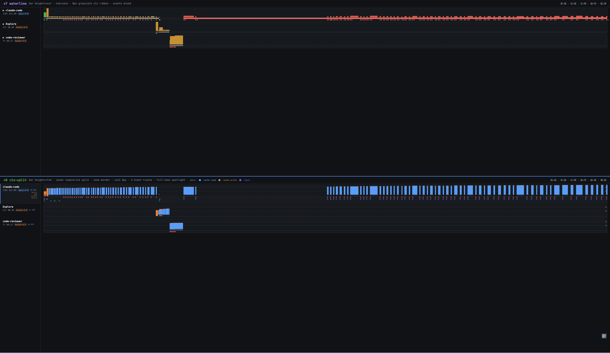
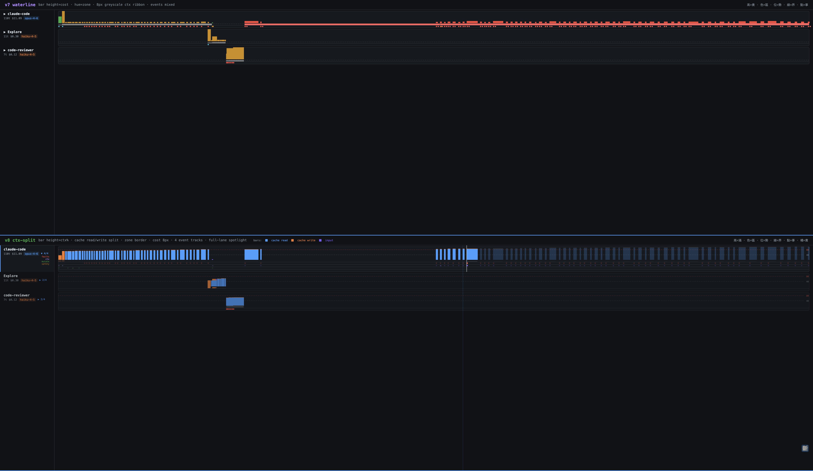

# Swimlane Turn Bar — 設計演進教材

ccxray Workflow View（issue #91）turn bar 視覺系統的迭代記錄。每個版本保留在
`turnbar-proto.html` 裡垂直排列，可以逐版對照「改了什麼、為什麼改」。

> 完整版含截圖、evaluator 批評原話、跨版本教訓總表：**`DESIGN-DECISIONS.md`**

## 怎麼看

```bash
python3 -m http.server 8199 --directory prototype/swimlane
# → http://localhost:8199/turnbar-proto.html           設計演進 v1–v6
# → http://localhost:8199/dashboard-v6.html            dashboard 整合 mock（v6）
# → http://localhost:8199/dashboard-v7-waterline.html  v7 waterline（autoresearch 收案 9.26/10）
# → http://localhost:8199/v7-vs-v8.html                v7 vs v8 並排比較（v8 ctx-split, 9.03/10）
```

資料是真實 session log（68134a99，128 turns，opus-4-6 + haiku-4-5），抽在 `data.js`。

## 編碼系統（4 維 bar）

> 口訣：**越高越貴，越深越滿，亮的閃的快爆，藍底沒 cache**

| 維度 | 編碼 | 值域 |
|------|------|------|
| height | cost | 2–44px（22:1） |
| hue | context zone | green <40% / yellow 40–80% / red >80% |
| lightness | context % | 深=滿；紅 zone ΔL=51（#ff9e99→#7a1a1a） |
| 亮紅頂邊 3px + pulse | context >80% | 形狀冗餘，色盲可辨 |

事件不進 bar——移到下方 8px event track（形狀+顏色 dots），
「上看 cost/context，下看事件」兩層分離。

## 版本演進

| 版本 | 分數 | 關鍵改動 | 學到什麼 |
|------|------|---------|---------|
| v1 | 7/10 | height+hue+lightness + cache/cost 展開行 | 展開行破壞 layout stability |
| v2 | 9.05 | min-width 4px、紅 ΔL ×2.3、灰虛線 model switch、尖角>80% | 密集區可讀性 > 精確位置 |
| v3 | 9.0 | 尖角→亮紅頂邊、green 左邊框 | 尖角信號強度跟 bar 寬度反相關（窄 bar 尖角看不見）——編碼不能依賴另一個自由變數 |
| v4 | 9.5 | 8px event track + flat filter toggles + hover-expand | 事件擠在 bar 邊框裡互相打架，分離軌道後 bar 回歸純 4 維 |
| v5 | 9.07 | Usage-style dropdown filter（群組 click=toggle，▾=子項） | flat toggles 不 scale，群組下拉借用使用者已知模式 |
| v6 | — | Jenkins-style session weather（☀️⛅☁️🌧️⛈️）掛 lane label | 聚合健康度放 session 層——turn 層已飽和、agent 層跨 session 無意義 |
| v7 | 9.26 | **Waterline**：bar 降 2.5 維（第 4 維 lightness 刪除），context 拆到 8px 灰階水位帶——L* 線性 #424242→#9b9b9b，≥80% 等亮轉 #ff6b6b（hue 突變、亮度不跳）+ 2px inset contour + pulse | (1) 有了多軌道後 bar 不必再壓 4 維；(2) 「zone hex 錨點 + L* 單調 ramp」數學不成立（實算 67/67/58）——有數值宣稱就要實算；(3) 「黃區漸進趨勢斜率可讀」在 8px 幾何上不可達（實算只爬 1.11px），目標改「水位級 + 碰線」 |

Weather 權重：error 40% · ctx>80% 30% · cache miss 20% · cost spike 10%，
80/60/40/20 切分五級（同 Jenkins）。已知限制：error cascade session 會直接打到
0 分，線性權重對「有點糟 vs 災難」無鑑別度。

v7 口訣：**高=貴 · 色=區 · 位=勢 · 線=界 · 點=事**（「越深越滿」隨第 4 維退役）。
v7 是 designer/evaluator 分離 subagent 的 autoresearch 產物（R1 8.50 → R2 8.91 →
R3 9.26 收案），實作守則與驗證清單見 memory `swimlane-turnbar-design`。
`dashboard-v7-waterline.html` 已內建：中性灰錨點、ctx>0 最小 1px hairline、
單 turn ctx≈0 異常跳過（turn 49 假斷崖防護）、80% 線半像素對齊 + danger 段內不繪、
最後 turn hold 到自身結束。

## 否決過的方案（別再走一次）

1. **opacity 編碼 context %** — 深色背景上 bar 消失（7.18/10）
2. **fill level 電池隱喻** — 兩個高度維度混淆 cost vs context（6.56/10）
3. **tick mark** — 2px 太安靜，preattentive 性差（8.11/10）
4. **尖角 clip-path** — 信號強度與 bar 寬度反相關
5. **事件標記塞 bar 邊框** — 多事件互相覆蓋
6. **turn/agent 層掛 weather** — turn 4D 已飽和；agent 跨 session 行為不同

## dashboard-v6.html 額外展示

- **左欄 lane heads（210px）+ 右欄獨立橫向捲動 chart**，row 高度鎖定對齊
- **Agent 命名用 system prompt 偵測**（`server/system-prompt.js` extractAgentType 三層
  fallback：KNOWN_AGENTS → regex "You are a [role]" → 'Agent'）；推斷名用 `≈` + 斜體標示
- **點 lane head 展開 → 事件分 4 固定軌道**（Tools/Context/Security/Cost，順序永不隨
  filter 改組）。展開後 dots 畫在真實時間 x——收合模式的 `ei*6` 水平錯開其實是
  時間軸失真（Tufte: Lie Factor），分軌道用垂直位置編碼分類後就不需要錯開
- **Filter 收窄時，被濾掉群組的軌道整條隱藏**（row 高度跟著縮），留下的軌道
  維持固定相對順序——隱藏 ≠ 重排
- **展開用推擠**不用 overlay（決策：資訊價值 > layout stability）
- **In-bar % label 碰撞檢查**——相鄰 label 中心距 <20px 只畫第一個
- Escape 鍵 reset filter

## v8 — ctx-split（9.03/10）

Bar 從 cost 改 ctx%（cache read/write split），zone 改 40%/80% threshold lines，cost 拆到獨立 8px track，事件軌道重新分類（Faults/Context/Mutations/Safety, exclusive color families），三態互動（Idle→Hover→Locked）含 1..N 累積 highlight + 跨 lane dim + global guide。

> 口訣：**高=滿 · 色=區 · 位=勢 · 線=界 · 點=事 · 橘=貴**





設計過程：4 位專家 subagent（Tufte/Charity Majors/Munzner/Willison）提案 → 3 輪 autoresearch（R1 7.41 → R2 8.53 → R3 9.03）。Zone 另經獨立 autoresearch（bands 5.95 否決 → threshold lines 9.0 通過）。

## 後續（正式實作到 public/workflow-timeline.js 時）

- [ ] agentKey 目前只在 server 的 versionIndex，要加到 entry summary / SSE broadcast
- [ ] subagent turns 在獨立 session，需 cross-session join 合併到 parent lane
- [ ] 色盲安全調色盤 toggle（Okabe-Ito）
- [ ] filter URL hash 同步、鍵盤操作（1–4 toggle 群組）
- [ ] weather 權重改非線性衰減
- [ ] v8 三態互動實作到 workflow-timeline.js
